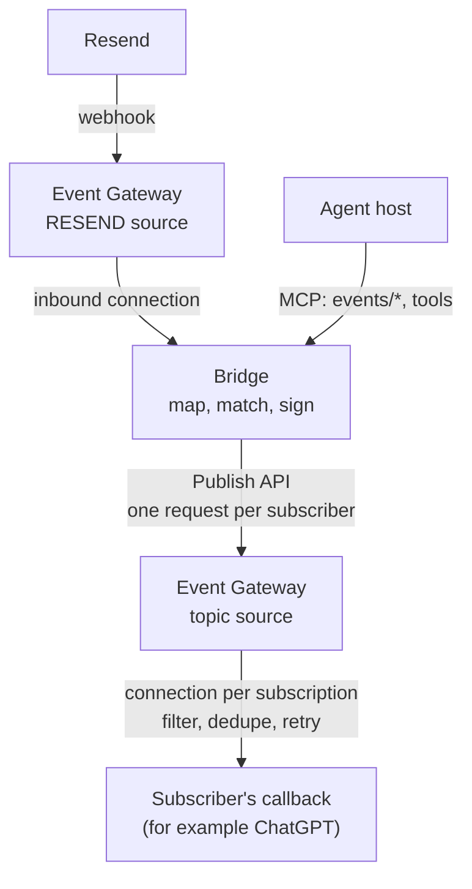

# MCP Events bridge

Subscribe an agent to things that happen in apps whose vendors haven't shipped [MCP Events](https://developers.openai.com/plugins/build/mcp-events). The bridge turns a provider's ordinary webhooks into MCP Events, with [Hookdeck Event Gateway](https://hookdeck.com) receiving, verifying and delivering them.

The first provider is Resend inbound email: someone emails an address on Resend, and an agent subscribed to `email.received` (for example in ChatGPT) wakes up and acts.

Status: a working demo, built in stages. See [`docs/PLAN.md`](docs/PLAN.md) for what's done and what's next, and [`docs/ARCHITECTURE.md`](docs/ARCHITECTURE.md) for the design.

## How it works



- **Event Gateway** verifies the provider's signature, keeps every request, and delivers each MCP Event to each subscriber with retries.
- **The bridge** is the MCP server: the event catalog, subscribe (with the endpoint challenge), and turning each provider webhook into a signed MCP Event per subscriber. It's stateless: subscriptions are Event Gateway connections, so there's no database.
- **The Hookdeck CLI** forwards provider events to a bridge on your laptop during development, so you don't need a public URL.

## Requirements

- Node 22 or later.
- A Hookdeck account, and a Hookdeck project for each deployment (for example one for development and one for production). Its Project API key and signing secret.
- The [Hookdeck CLI](https://hookdeck.com/docs/cli), for local development.
- A Resend account and an API key that can create webhooks. Every Resend account gets a receiving domain (`<id>.resend.app`; Emails > Receiving > ... > Receiving address), so no custom domain is needed. To send test emails, a verified sending domain.

## Run it locally

1. Install:

   ```sh
   npm install
   cp .env.example .env
   ```

   Fill in `HOOKDECK_API_KEY`, `HOOKDECK_SIGNING_SECRET` and `RESEND_API_KEY`. For the end-to-end check, also `RESEND_INBOUND_ADDRESS` (any address on your receiving domain) and `RESEND_TEST_FROM` (an address on your verified sending domain).

2. Configure providers in `bridge.config.ts`:

   ```ts
   import { defineConfig, env } from '@hookdeck/mcp-events-bridge';
   import { resend } from '@hookdeck/mcp-events-bridge/providers';

   export default defineConfig({
     deployment: 'dev',
     providers: [resend({ apiKey: env('RESEND_API_KEY'), events: ['email.received'] })],
   });
   ```

   (This repo's own `bridge.config.ts` imports from `./src` instead.)

3. Create the Event Gateway resources and the Resend webhook:

   ```sh
   npm run bridge -- setup
   ```

   The first run generates an MCP secret; put it in `.env` as `BRIDGE_MCP_SECRET`. Setup is safe to re-run.

4. Run the bridge, and forward events to it with the Hookdeck CLI (the exact commands are printed by `setup` and `serve`):

   ```sh
   npm run bridge -- serve
   hookdeck listen 8080 bridge-resend bridge-resend-dev
   hookdeck listen 8080 bridge-hookdeck-notifications bridge-notifications-dev
   ```

5. Check the whole path with real email:

   ```sh
   npm run e2e
   ```

   This starts its own bridge and `hookdeck listen`, subscribes a test subscriber (behind a cloudflared quick tunnel, because the MCP Events challenge needs a synchronous answer), sends emails through Resend, and checks delivery, that `webhook-id` equals Resend's `svix-id`, `get_event`, the `from` filter, and unsubscribe. `E2E_EXTENDED=1` adds a failed publish and its retry, a duplicate provider delivery, a `410` deleting a subscription, and `deliveryStatus` for a failing callback (about 10 minutes).

## Deploy to Fly.io

`fly.toml` and the `Dockerfile` run one always-on machine; there's no volume, since Event Gateway is the store.

```sh
fly apps create <app>                      # then set app in fly.toml
fly secrets set HOOKDECK_API_KEY=... HOOKDECK_SIGNING_SECRET=... RESEND_API_KEY=... BRIDGE_MCP_SECRET=...
fly deploy
BRIDGE_DEPLOYMENT=fly BRIDGE_INBOUND=http BRIDGE_PUBLIC_URL=https://<app>.fly.dev npm run bridge -- setup
E2E_BRIDGE_URL=https://<app>.fly.dev npm run e2e
```

Use a separate Hookdeck project for each deployment: deployments in one project share the provider source and the subscriptions.

## Connect ChatGPT

With Developer mode on (ChatGPT Plus or above), go to Plugins, choose Add > Create MCP App, paste `https://<app>.fly.dev/mcp/<BRIDGE_MCP_SECRET>`, and choose No Authentication. Then, in a Work chat, ask to be told about new emails, for example from a particular sender.

The URL is a credential: anyone with it can use the bridge's MCP endpoint. Keep it private. OAuth options are planned (see "Authentication" in the architecture doc).

## Configuration

| Variable | Purpose |
| --- | --- |
| `HOOKDECK_API_KEY` | Project API key, for the Event Gateway API and the Publish API |
| `HOOKDECK_SIGNING_SECRET` | Verifies Event Gateway's signature on requests to the bridge |
| `RESEND_API_KEY` | Creates the Resend webhook (referenced from `bridge.config.ts`) |
| `BRIDGE_MCP_SECRET` | Secret path segment of the MCP URL; `setup` generates one |
| `BRIDGE_DEPLOYMENT` | Names this deployment's Event Gateway resources (read by this repo's `bridge.config.ts`) |
| `BRIDGE_INBOUND` | `cli` (development, through `hookdeck listen`) or `http` (deployed); defaults to `http` on Fly.io |
| `BRIDGE_PUBLIC_URL` | For `http` inbound; defaults to `https://$FLY_APP_NAME.fly.dev` on Fly.io |
| `BRIDGE_PORT` | Listener port (default 8080) |

## MCP surface

- `events/list`, `events/subscribe`, `events/unsubscribe` (webhook delivery).
- `get_event(eventId)` and `list_recent_events(name?, since?, limit?)`: past events, read from Event Gateway.
- `list_providers()`: configured providers and their subscriptions.

## Tests

```sh
npm test          # unit and in-process integration tests, with a fake Event Gateway
npm run typecheck
```

## License

MIT
