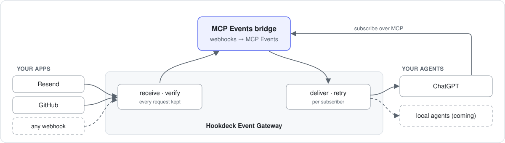
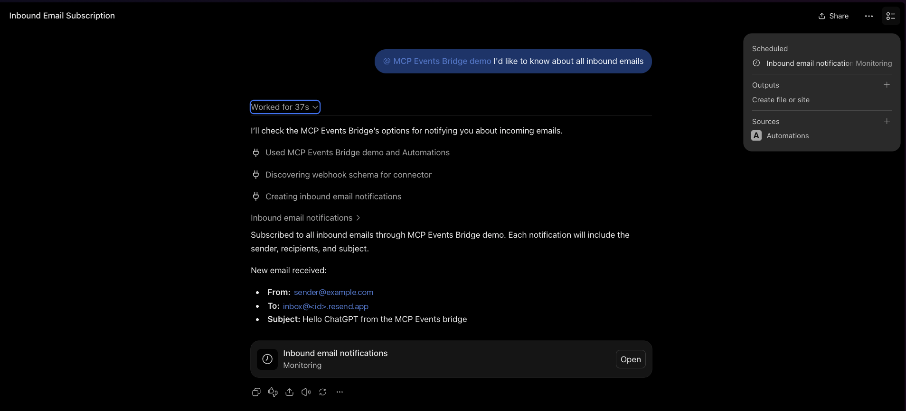
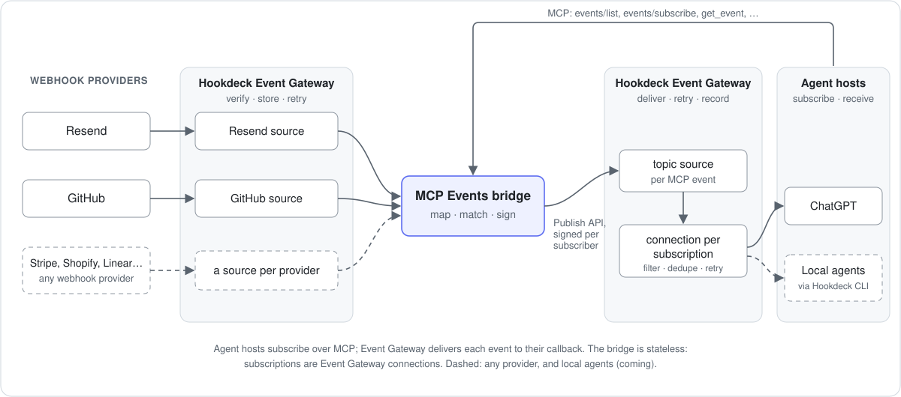
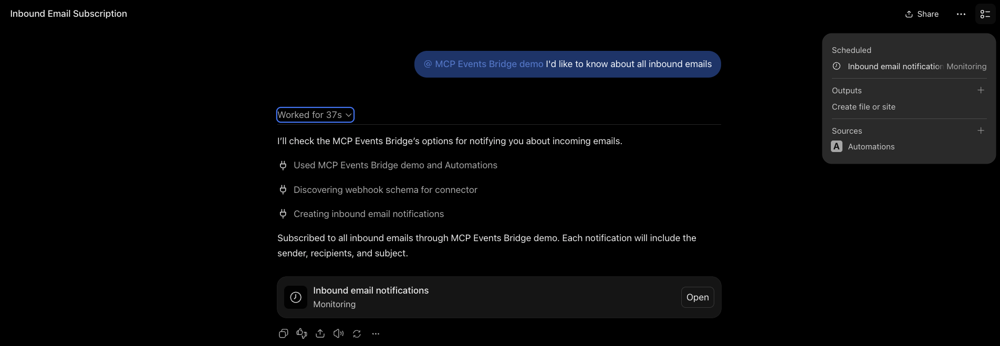

# MCP Events bridge

Turn webhooks into [MCP Events](https://developers.openai.com/plugins/build/mcp-events), so AI agents can act the moment something happens: an email arrives, an issue is opened, a workflow fails. [Hookdeck Event Gateway](https://hookdeck.com) receives, verifies and delivers every event.



For example, an email arrives at a Resend address, and ChatGPT, subscribed through the bridge, acts on it:



## Why

MCP Events is an experimental MCP extension that lets an agent subscribe to events instead of polling for them, and ChatGPT supports it. But an agent can only subscribe to MCP servers that implement it, and almost none do yet, while nearly every service already sends webhooks.

The bridge closes that gap:

- **Webhooks become MCP Events.** Built-in webhook providers: Resend inbound email, GitHub, and generic webhooks from any HTTP sender, such as a service you've built, verified with HMAC, Standard Webhooks, Basic auth or an API key. Add others with `defineProvider`.
- **Subscribers choose what wakes them.** Events have filters, such as an email's sender, or a GitHub repository and action.
- **Every event verified, delivered and recorded.** Event Gateway verifies provider signatures, retries failed deliveries, drops duplicates within an hour, and keeps a record of every event and attempt.
- **Stateless.** Each subscription is an Event Gateway connection, so there's no database.

It's for developers who want agents (ChatGPT, and agents on the same machine as the bridge) to react to events from the services they already use.

**Status:** 0.2, a working demo built in stages. MCP Events is experimental, and this package may change with it. See [`docs/PLAN.md`](docs/PLAN.md) for what's done and what's next, and [`CHANGELOG.md`](CHANGELOG.md) for changes between versions.

## How it works



- **Event Gateway** verifies each provider's webhook signature, keeps every request, and delivers each MCP Event to each subscriber with retries.
- **The bridge** is the MCP server: it lists the events on offer, handles subscribe (including the spec's endpoint challenge), and turns each provider webhook into an MCP Event signed for each subscriber.
- **The Hookdeck CLI** forwards provider events to a bridge on your laptop, and MCP Events to [local agents](#local-agents), so neither needs a public URL.

The design, its trade-offs and how it maps to the spec are in [`docs/ARCHITECTURE.md`](docs/ARCHITECTURE.md).

## Set up with a coding agent

The [`mcp-events-bridge` skill](skills/mcp-events-bridge/SKILL.md) walks a coding agent (Claude Code, Cursor, Codex and others that support [Agent Skills](https://agentskills.io)) through setup, adding providers, connecting an agent and troubleshooting, with a success signal for each step:

```sh
npx skills add hookdeck/mcp-events-bridge
```

Then ask the agent to set up the bridge. It asks you for the credentials. The skill is also in the npm package, under `skills/`.

## Quick start

You need:

- Node 22.12 or later.
- A [Hookdeck](https://hookdeck.com) account and a project for the bridge. From the project's settings (Secrets): the **API key** and the **signing secret**.
- The [Hookdeck CLI](https://hookdeck.com/docs/cli), for running the bridge locally (and for `npm run e2e`).
- At least one [webhook provider](#webhook-providers): a Resend or GitHub account, or any service that sends webhooks, including your own.

1. **Create a project and install the bridge:**

   ```sh
   mkdir my-bridge && cd my-bridge
   npm init -y && npm pkg set type=module
   npm install @hookdeck/mcp-events-bridge
   printf 'node_modules/\n.env\n.hookdeck/\n' > .gitignore   # .env and .hookdeck/ hold credentials
   ```

2. **Choose webhook providers** in `bridge.config.ts`:

   ```ts
   import { defineConfig, env } from '@hookdeck/mcp-events-bridge';
   import { github, resend } from '@hookdeck/mcp-events-bridge/providers';

   export default defineConfig({
     providers: [
       resend({ apiKey: env('RESEND_API_KEY') }),
       // Only `setup` uses the token, so it's optional here: a deployed bridge runs without it.
       github({ token: env('GITHUB_TOKEN', { optional: true }), scope: { repos: ['your-org/your-repo'] } }),
     ],
   });
   ```

   Keep only the providers you use. Each one's options are under [Webhook providers](#webhook-providers).

3. **Add credentials** to `.env`:

   ```sh
   HOOKDECK_API_KEY=...
   HOOKDECK_SIGNING_SECRET=...
   RESEND_API_KEY=...      # if you use Resend
   GITHUB_TOKEN=...        # if you use GitHub
   ```

4. **Create the Event Gateway resources and the provider webhooks:**

   ```sh
   npx mcp-events-bridge setup
   ```

   The first run generates an MCP secret: add it to `.env` as `BRIDGE_MCP_SECRET`. Setup is safe to re-run, and updates the webhooks when you add providers or change events or repositories. Removing a provider or a repository deletes nothing: delete its webhook (and its Event Gateway connection) yourself.

5. **Run the bridge:**

   ```sh
   npx mcp-events-bridge serve
   ```

   Locally, `serve` checks that setup has run and starts `hookdeck listen` for every provider, so events reach your laptop through the Hookdeck CLI; it restarts `listen` if it stops, and recovers events that arrived while the bridge was down. Send an email to your Resend address, or open an issue, and the bridge logs it.

6. **Connect an agent:** see [Connect ChatGPT](#connect-chatgpt). ChatGPT has to reach the bridge's MCP endpoint, so [deploy](#deploy-to-flyio) the bridge, or expose your local port with a tunnel such as `cloudflared tunnel --url http://127.0.0.1:8080` and use `https://<tunnel host>/mcp/<BRIDGE_MCP_SECRET>`. Events don't need the tunnel: Event Gateway delivers them to ChatGPT directly.

## Connect ChatGPT

With Developer mode on (ChatGPT Plus or above), go to Plugins, choose Add > Create MCP App, paste `https://<your bridge>/mcp/<BRIDGE_MCP_SECRET>`, and choose No Authentication. Then, in a Work chat, ask to be told about new events, for example emails from a particular sender. ChatGPT subscribes and sets up a monitoring task:



When an event arrives, the task runs with it, as in the screenshot at the top.

ChatGPT keeps the list of events it can subscribe to from when you added the plugin. After you upgrade the bridge or add a provider, refresh the plugin in Plugins, or ChatGPT can't subscribe to the new or renamed events (it may still list them, since that call goes to the bridge). Then ask it to subscribe again.

The MCP URL is a credential: anyone with it can use the bridge. Keep it private (see [Security and limitations](#security-and-limitations)).

## Webhook providers

Each provider in `bridge.config.ts` is an instance with an `id` (by default its type: `resend`, `github`). Its events are offered over MCP as `{id}.{event}`, where `event` is the provider's own name for it: `resend.email.received`, `github.issues`. So `events/list` says which provider each event comes from, and two instances can offer the same kind of event (two Resend accounts, two trading servers) under different ids. Renaming an `id` renames its events, so agents need to subscribe again.

### Resend

Inbound email. Every Resend account has a receiving domain (`<id>.resend.app`; Emails > Receiving), so no custom domain is needed.

- **Options:** `resend({ apiKey })`. The API key needs permission to create webhooks.
- **Event:** `email.received` (offered as `resend.email.received`), with the sender, recipients, subject and Resend's email id. Read the full email with Resend's own API.
- **Filters:** `from` (recommended: it limits who can wake the agent) and `to`.

### GitHub

One event per GitHub webhook type: `issues`, `pull_request`, `push`, and so on (26 types), offered as `github.issues`, `github.pull_request`, `github.push`.

- **Events:** by default issues, issue comments, pull requests, reviews, pushes, releases and workflow runs. Choose with GitHub's names, `events: ['issues', 'push', ...]`, or `['*']` for all.
- **Filters:** `repository`, `actions` (for example `["opened"]`) and `sender`.
- **Summary:** repository, action, sender, title, number and URL for every type, plus a few fields for the common ones (labels, branches, merged, ref, commit count, workflow conclusion). Payloads aren't passed through; read details with GitHub's own tools.

Two ways to connect repositories:

| Mode | Options | Who adds the webhooks |
| --- | --- | --- |
| **Automatic** | `github({ token, scope: { repos: ['owner/name', ...] } })`, or `scope: { org: 'name' }` for every repository in an organization | `setup`, with a fine-grained token that has the Webhooks (read and write) permission. For an organization's repositories, the token's resource owner must be the organization. `scope: { org }` creates one organization webhook, which needs an organization owner and the organization Webhooks permission |
| **Manual** | `github({ webhookSecret })`, no token | You: in each repository, Settings > Webhooks > Add webhook, with the Payload URL `setup` prints, content type `application/json`, and the same secret |

### Generic webhooks

Webhooks from any HTTP sender: a service you run yourself, or a provider the bridge has no built-in support for. For example, instead of an agent polling a trading server's orders every bar to see whether an order filled, the server sends a webhook when it fills, and the agent subscribes to `fills.order.filled` for the symbols it trades:

```ts
import { defineConfig, env } from '@hookdeck/mcp-events-bridge';
import { webhook } from '@hookdeck/mcp-events-bridge/providers';

export default defineConfig({
  providers: [
    webhook({
      id: 'fills',                       // names the Event Gateway source: bridge-fills
      verification: { type: 'hmac', algorithm: 'sha256', encoding: 'hex', header: 'x-signature', secret: env('FILLS_WEBHOOK_SECRET') },
      events: { 'order.filled': { description: 'An order on my trading server filled.' } },
      eventId: { header: 'x-delivery-id' },     // stable across the sender's retries
      occurredAt: { field: 'filled_at' },
      filters: ['symbol', 'side'],              // an agent subscribes with { "symbol": "AAPL" }
    }),
  ],
});
```

The server signs each request's raw body with HMAC-SHA256 and the shared secret, hex-encoded in `x-signature`, and POSTs JSON such as `{ "symbol": "AAPL", "side": "buy", "quantity": 100, "price": 187.5, "filled_at": "2026-10-07T14:30:00Z" }`.

- **`verification`** (required): Event Gateway verifies every request and rejects the rest before they reach the bridge. One of:
  - `{ type: 'hmac', algorithm, encoding, header, secret }`: an HMAC of the raw body in a header. `algorithm` is `sha1`, `sha256` or `sha512`; `encoding` is `hex`, `base64` or `base64url`. A `sha256=` prefix on the value is accepted. The key is the secret string as written (UTF-8), not decoded from hex or base64.
  - `{ type: 'standard-webhooks', secret }`: [Standard Webhooks](https://www.standardwebhooks.com) signatures, usually with a `whsec_...` secret.
  - `{ type: 'basic-auth', username, password }` or `{ type: 'api-key', header, key }`: a shared credential sent with every request. Prefer a signature: Event Gateway keeps request headers, so these credentials are stored with each request, and anyone who sees one can replay it.
  There's no unverified option: anyone with the URL could otherwise wake your agents with whatever they send.
- **`events`:** the sender's event names (offered as `{id}.{name}`, e.g. `fills.order.filled`), as a list or with a description each. With more than one, `eventType` says where the sender names the event, `{ header }` or `{ field }` (a dot path into the body), and each event's `value` is the sender's name for it (default: the event name). Requests for other values are ignored.
- **`eventId`:** the sender's id for a delivery, from `{ header }` or `{ field }`. It becomes the event's `webhook-id`, and Event Gateway drops repeats within an hour. Default: Event Gateway's request id, which stays the same when Event Gateway retries but not when the sender does, so set it if your sender retries.
- **`occurredAt`:** a body field with an ISO 8601 or Unix time. Default: when the request was received (by the bridge for a delivery; by Event Gateway for `get_event` and `list_events`).
- **Data:** the JSON body as sent, or only the top-level fields in `fields: [...]`. Bodies must be JSON (anything else is ignored, and stays in Event Gateway), and the event at most 256 KiB.
- **`filters`:** top-level body fields subscribers can filter on, by exact match.

Credentials are `env()` references. The sender usually gives you its secret only after you register the URL, so the bridge can create the source first:

1. **Create the source and the config entry:**

   ```sh
   npx mcp-events-bridge providers add webhook fills --event order.filled --event-id-header x-delivery-id --filter symbol --filter side
   ```

   It creates the Event Gateway source `bridge-fills` and prints its URL, adds `FILLS_WEBHOOK_SECRET=` to `.env` (empty, and only if `.env` doesn't have it), and prints the `webhook({...})` entry to paste into `providers`. `--write-config` adds the entry to `bridge.config.ts` itself (creating the file if there isn't one), or prints it if the file isn't a shape it can edit safely (for example providers built conditionally). `--verification` chooses `hmac` (the default; `--algorithm`, `--encoding` and `--header` set the rest), `standard-webhooks`, `basic-auth` or `api-key`; `providers add webhook --help` lists every option. Re-running it reuses the source and adds nothing twice.
2. **Register the URL with the sender,** and copy the secret it gives you (or, for your own server, generate one with `openssl rand -hex 32` and give it to the server).
3. **Put the secret in `.env`:** `FILLS_WEBHOOK_SECRET=...`.
4. **Run `npx mcp-events-bridge setup`.** It sets the secret on the source and connects the source to the bridge. A new or changed secret can take up to about a minute to take effect at Event Gateway; the bridge ignores any request Event Gateway didn't verify in the meantime.

Until the secret is set, delivery is held: `setup` creates no connection from the source to the bridge, so requests that arrive are kept in Event Gateway but never delivered. `setup` still sets up everything else, then exits with an error naming the variable (so a deploy script or CI notices), and `serve` refuses to start.

### Adding a webhook provider

For a sender that signs with HMAC, Standard Webhooks, Basic auth or an API key, the generic provider above needs no code. Otherwise, a provider is a `defineProvider({...})` object: the Event Gateway source type (or a `WEBHOOK` source with the verification config in `sourceConfig`), how to recognize and summarize each event, the subscribe filters, and optionally how to register the webhook. See ["Adding a provider"](docs/ARCHITECTURE.md#adding-a-provider) and the built-in [Resend](src/core/providers/resend.ts), [GitHub](src/core/providers/github.ts) and [generic webhook](src/core/providers/webhook.ts) providers.

## Deploy to Fly.io

Any host that runs Node works; Fly.io is the reference. The bridge needs no volume, since Event Gateway is the store.

Add a `Dockerfile` to your project:

```dockerfile
FROM node:22-slim
WORKDIR /app
ENV NODE_ENV=production
COPY package.json package-lock.json ./
RUN npm ci --omit=dev
COPY bridge.config.ts ./
EXPOSE 8080
CMD ["npx", "mcp-events-bridge", "serve"]
```

Then:

```sh
fly launch --no-deploy        # creates fly.toml: set internal_port = 8080, and BRIDGE_DEPLOYMENT = 'fly' under [env]
fly secrets set HOOKDECK_API_KEY=... HOOKDECK_SIGNING_SECRET=... RESEND_API_KEY=... BRIDGE_MCP_SECRET=...
BRIDGE_DEPLOYMENT=fly BRIDGE_INBOUND=http BRIDGE_PUBLIC_URL=https://<app>.fly.dev npx mcp-events-bridge setup
fly deploy
```

On Fly.io, the bridge receives events over HTTP at its public URL instead of through the Hookdeck CLI, using the `fly` resources that `setup` created. Only `setup` needs `GITHUB_TOKEN`, so it doesn't have to be a Fly secret; in GitHub's manual mode, set `GITHUB_WEBHOOK_SECRET` as a Fly secret too, and likewise each generic webhook's credentials. The Dockerfile copies only `bridge.config.ts`: copy any other files your config imports, such as your own providers.

Use a separate Hookdeck project for each environment you want isolated: deployments in one project share the provider sources and the subscriptions. An optional namespace for sharing a project is proposed in [#13](https://github.com/hookdeck/mcp-events-bridge/issues/13).

## What setup creates

In the Event Gateway dashboard, a running bridge looks like this:


- **`bridge-<provider>`** (here `bridge-resend`) is the provider's source. It feeds one inbound connection per deployment: `bridge-resend-local` (CLI, to a bridge on your machine) and `bridge-resend-fly` (HTTP, to the bridge on Fly.io; the screenshot predates the `local` name).
- **`bridge-out-<event>`** (the MCP event name, slugged: `bridge-out-resend_email_received`; the screenshot predates `{id}.{event}` naming) is the topic source the bridge publishes each MCP event to. Each subscription is one connection from it, `mcp-sub-<id>`, with filter, dedupe and retry rules, to a destination at the subscriber's callback.
- **`bridge-hookdeck-notifications`** receives Event Gateway's issue notifications and forwards them to each deployment, so the bridge hears about failing callbacks and reports them to subscribers.

Locally (CLI inbound), `setup` also logs the Hookdeck CLI in to the bridge's project in `.hookdeck/config.toml` (gitignore it: it holds a key), so `hookdeck` commands run in the bridge's directory use that project rather than your global login.

## Configuration

### The bridge

Every deployment needs these, whichever providers it uses.

| Variable | Required | Purpose |
| --- | --- | --- |
| `HOOKDECK_API_KEY` | Yes | Project API key, for the Event Gateway API and the Publish API |
| `HOOKDECK_SIGNING_SECRET` | Yes | Verifies Event Gateway's signature on requests to the bridge |
| `BRIDGE_MCP_SECRET` | To run `serve` | Secret path segment of the MCP URL; `setup` generates one |
| `BRIDGE_INBOUND` | No | `cli` (through `hookdeck listen`) or `http` (a public URL). Default: `http` on Fly.io, `cli` elsewhere |
| `BRIDGE_PUBLIC_URL` | For `http` inbound off Fly.io | The bridge's public URL. Default on Fly.io: `https://$FLY_APP_NAME.fly.dev` |
| `BRIDGE_PORT` | No | Listener port (default: `PORT`, else 8080) |
| `BRIDGE_DEPLOYMENT` | No | Names this bridge's Event Gateway resources: its inbound connections become `bridge-<provider>-<deployment>`. It doesn't keep bridges in one Hookdeck project apart: they share the provider sources, subscriptions and tunnel URLs, so give each bridge its own project ([#13](https://github.com/hookdeck/mcp-events-bridge/issues/13)). Default: `local` with `cli` inbound, `public` with `http` inbound (`deployment` in `bridge.config.ts` takes precedence) |
| `BRIDGE_HOOKDECK_CLI_CONFIG` | No | Where `setup` and `serve` log the Hookdeck CLI in to the bridge's project, for `hookdeck listen` and any `hookdeck` command run in that directory (default `.hookdeck/config.toml`); the inbound recovery watermark is kept next to it |

`defineConfig` also takes `inbound`, `publicUrl`, `port` and `hookdeck` directly, and `subscriptions` for subscription lifetimes. Run `npx mcp-events-bridge` for the commands and flags.

### Webhook providers

Set only what the providers in your `bridge.config.ts` need. The names are the ones the examples pass to `env()`; use your own if you prefer.

#### Resend

| Variable | Required | Purpose |
| --- | --- | --- |
| `RESEND_API_KEY` | Yes | API key that can create webhooks. `setup` registers the webhook with it, and the example config requires it wherever the bridge runs |

#### GitHub

| Variable | Required | Purpose |
| --- | --- | --- |
| `GITHUB_TOKEN` | In automatic mode | Fine-grained token with the Webhooks (read and write) permission. Only `setup` uses it |
| `GITHUB_WEBHOOK_SECRET` | In manual mode | The secret on the webhooks you add (at least 16 characters). Needed wherever the bridge runs |

#### Generic webhooks

Each `webhook()` instance's credentials, named as its `env()` references name them. `providers add webhook <id>` uses these names:

| Variable | Required | Purpose |
| --- | --- | --- |
| `<ID>_WEBHOOK_SECRET` | For `hmac` and `standard-webhooks` | The signing secret the sender uses |
| `<ID>_WEBHOOK_API_KEY` | For `api-key` | The key the sender sends in its header |
| `<ID>_WEBHOOK_USERNAME`, `<ID>_WEBHOOK_PASSWORD` | For `basic-auth` | The sender's Basic auth credentials |

`<ID>` is the instance id, upper-cased, with other characters as `_` (`fills` gives `FILLS_WEBHOOK_SECRET`). Needed wherever the bridge runs: `setup` sets them on the Event Gateway source, and `serve` refuses to start without them.

## MCP surface

- `events/list`, `events/subscribe`, `events/unsubscribe`, with webhook delivery, and `events/poll`, for poll delivery. Event names are `{id}.{event}` (see [Webhook providers](#webhook-providers)).
- `poll_events(name, arguments?, cursor?, maxAgeMs?, maxEvents?)` and `wait_for_event(name, arguments?, cursor?, timeoutMs?)`: the same polling as tools, for MCP clients without MCP Events support (see [Polling](#polling)).
- `get_event(name, eventId)` and `list_events(name?, since?, limit?)`: events that happened, read from Event Gateway (`events/list` is the catalog of events you can subscribe to). `get_event` takes the event's name as well as its id, since an id is the provider's own and two instances can share one.
- `list_providers()`: configured providers and their subscriptions.
- `create_tunnel_url` and `list_tunnel_urls`: public URLs for agents on the same machine as a local bridge (see below). Not offered by a deployed bridge.

## Polling

For MCP clients that can't receive webhooks, or don't support MCP Events yet. A client that implements MCP Events poll mode calls `events/poll`; any other MCP client, such as Claude Code, Codex or Cursor, calls the `poll_events` and `wait_for_event` tools, which take the same arguments and cursor:

```sh
claude mcp add --transport http events-bridge 'https://<bridge>/mcp/<BRIDGE_MCP_SECRET>'
```

Then ask the agent to wait for an event (Claude Code: see [the guide](skills/mcp-events-bridge/references/claude-code.md)), for example "wait for fills.order.filled for AAPL and tell me about each fill". It calls `wait_for_event`, which returns as soon as there are events (or after up to 50 seconds with none), and calls it again with the `cursor` it returned.

- **No public URL needed:** each poll reads the provider's requests from Event Gateway, so it works from a laptop, with a deployed or a local bridge.
- **Start from now:** a first call without a cursor returns no events, only a cursor. For events that already happened, use `list_events`.
- **At least once:** events can repeat, so dedupe by `eventId`. `truncated: true` means events were skipped (`maxAgeMs`, or older than Event Gateway keeps).
- **Latency:** an event reaches a poller about 2 seconds after Event Gateway receives it, sometimes up to 15. Polls share one listing of Event Gateway's requests, at most every 2 seconds, so the API's rate limit (240 requests a minute per key) is shared, however many agents poll, as long as each polls at the `nextPollMs` it's given (`wait_for_event` does). When the limit runs low, `nextPollMs` grows to 30 seconds.

### In the background: `watch`

`mcp-events-bridge watch` polls a running bridge from now on and prints each event on its own line, as JSON (`{ eventId, name, timestamp, data }`), until stopped:

```sh
npx mcp-events-bridge watch github.issues github.issue_comment --filter repository=hookdeck/hookdeck-demos
```

Run it under an agent that wakes on a command's output, and the agent hears about events while it's idle or busy with something else. In Claude Code, that's the Monitor tool: ask Claude to watch in the background with this command (see [the guide](skills/mcp-events-bridge/references/claude-code.md#3-watch-in-the-background)). It reads the MCP URL from `--url`, `BRIDGE_MCP_URL`, or `BRIDGE_MCP_SECRET` with `BRIDGE_PUBLIC_URL` (or the local port), and retries when the bridge can't be reached. `watch --help` lists the options.

## Local agents

An agent on a laptop has no public URL to receive webhooks on. Run the bridge on the same machine, in its own Hookdeck project, and it gives the agent one per subscription, through Event Gateway and the Hookdeck CLI:

1. **Create a tunnel URL** with the `create_tunnel_url` tool: your `agent` name, a `name` for the subscription, and your local `port` (default 3000) and `path` (default `/events`). Your first URL sets the port and path, and the rest share them.
2. **Subscribe** with `events/subscribe`, using the URL and a `whsec_` secret your agent generates. Event Gateway answers the challenge. Deliveries arrive at `http://localhost:<port><path>`, signed with your secret; route them by `X-MCP-Subscription-Id`.

That's all the agent does. The bridge runs `hookdeck listen` for your port, and restarts it to cover each new URL. Deliveries missed while `listen` was down (the laptop slept, or during a restart) wait in Event Gateway, and the bridge sends them again when it reconnects, with the same `webhook-id` and a fresh signature, so standard verification (including its 5-minute window) passes. Delivery is at least once: dedupe by `webhook-id`. Provider events that reach Event Gateway while the bridge itself is stopped are recovered the same way when it starts again.

If your agent builds every callback URL from one base URL plus a path, create one tunnel URL with path `/` and use it as the base: the URL covers the paths under it. A tunnel URL only accepts deliveries signed by the bridge, and one that no subscription has used for an hour is deleted. An agent name is a label, not an identity: any client of the bridge's owner can use it.

What an agent's receiver has to do (signatures, dedupe, missed deliveries) is in [`skills/mcp-events-bridge/references/receiving-deliveries.md`](skills/mcp-events-bridge/references/receiving-deliveries.md). `npm run e2e` tests this path with a mock agent; see [`docs/PLAN.md`](docs/PLAN.md).

### Hermes Agent (experimental)

[Hermes Agent](https://github.com/NousResearch/hermes-agent) works with a local bridge through a tunnel URL: it subscribes, and each event wakes it in its own session. Released Hermes doesn't support MCP Events; support is in a draft pull request that may or may not be merged, [hermes-agent#132908](https://github.com/NousResearch/hermes-agent/pull/132908), which includes fixes from running it against this bridge.

[`skills/mcp-events-bridge/references/hermes-agent.md`](skills/mcp-events-bridge/references/hermes-agent.md) installs Hermes from that pull request at a tested commit, and covers the tunnel URL, Hermes's configuration, subscribing and checking a delivery. Hermes keeps the bridge's MCP URL in its `.env` as a named emitter, so the URL's secret stays out of the model's context and Hermes's logs.

## Security and limitations

- **The MCP URL is a credential.** One secret URL authenticates one owner. It's redacted from the bridge's logs and can be rotated by changing `BRIDGE_MCP_SECRET`. OAuth is planned.
- **Inbound requests must be signed.** The bridge accepts only requests signed by Event Gateway, which verifies each provider's own signature first. Generic webhooks have no unverified option, and the bridge relays only requests Event Gateway marked as verified.
- **Event content is data, not instructions.** An email or issue can say anything. Filters narrow what triggers an agent: GitHub's `sender` is the authenticated user, but an email's `from` can be forged, so don't rely on it alone.
- **Webhook and poll delivery.** Push (`events/stream`) may come later if clients need it. Local agents receive webhooks through the Hookdeck CLI (above). Poll mode misses a request that takes more than 60 seconds to appear in Event Gateway's request listing (it took up to 15 when measured).
- **Retries reuse the first signature.** The spec asks for a fresh signature on each attempt. Retries are kept inside the 5-minute window receivers check, until Event Gateway signs deliveries itself.

## Troubleshooting

| Symptom | Cause | Fix |
|---|---|---|
| `setup` exits 1: "Setup isn't complete", then `<id>: set <VAR>` | A generic webhook's secret isn't set; everything else was set up | Register the printed URL with the sender, put the secret in `.env`, run `setup` again |
| `serve`: "Event Gateway isn't set up for deployment ..." | `setup` hasn't run with this deployment name and inbound mode | Run `setup` with the same `BRIDGE_DEPLOYMENT` and `BRIDGE_INBOUND` |
| `serve` logs `subscription ... is for "...", which this bridge doesn't offer` | The provider was removed, its `id` renamed, or the subscription is from 0.1.0 (before `{id}.{event}` names); or it belongs to another bridge in the same Hookdeck project | The agent subscribes again, to a name from `events/list`; ignore another bridge's |
| `events/subscribe` fails with "Unknown event" | An old or wrong name | Use a name from `events/list` |
| A generic webhook sender gets 401 | Wrong signature, header, encoding or secret | Match the provider's `verification`; a new secret can take about a minute to apply |
| `serve` logs `0/0 published` | No subscription matches the event's name or filters | Check the subscription's name and arguments with `list_providers` |
| An event takes a minute or two | `hookdeck listen` occasionally takes ~30s to connect, and Event Gateway occasionally queues a CLI delivery | Wait: the bridge re-sends missed deliveries itself |
| The same event twice | Two bridges in one Hookdeck project, or a retry | One Hookdeck project per bridge; receivers dedupe by `webhook-id` |

## Development

```sh
git clone https://github.com/hookdeck/mcp-events-bridge && cd mcp-events-bridge
npm install
cp .env.example .env      # fill in; the comments explain each variable
npm test                  # unit and in-process integration tests, with a fake Event Gateway
npm run typecheck
npm run build             # compiles to dist/, as published
npm run bridge -- setup   # the CLI from source; this repo's bridge.config.ts imports from ./src
```

`npm run e2e` checks the whole path against real services. It starts a bridge and `hookdeck listen`, subscribes test subscribers whose callbacks are Event Gateway MCP Events sources (they answer the spec's challenge; `hookdeck listen` forwards deliveries), sends real email through Resend, and checks delivery, filters, `get_event` and unsubscribe. `E2E_SOURCE=webhook` drives the same checks with signed fills to the generic webhook provider instead of emails, so it sends no email and uses no Resend quota (needs `FILLS_WEBHOOK_SECRET`, as below). `E2E_GITHUB=1` adds a real GitHub push; `E2E_LOCAL=1` adds a mock local agent receiving through tunnel URLs, with the bridge running `hookdeck listen` and catching up by itself, and the bridge recovering its own missed inbound; `E2E_WEBHOOK=1` adds the generic webhook provider, with the script as a trading server sending signed and wrongly signed fills (needs `FILLS_WEBHOOK_SECRET`, which enables the `fills` instance in this repo's `bridge.config.ts`, and `setup` run with it); `E2E_EXTENDED=1` adds retries, duplicates, a `410` and failing callbacks (about 10 minutes; the status-code subscribers use a cloudflared tunnel, since an MCP Events source acknowledges deliveries itself); `E2E_BRIDGE_URL=https://...` runs against a deployed bridge.

Issues and pull requests are welcome. [`AGENTS.md`](AGENTS.md) has the project's conventions, for people and coding agents alike.

Releases are published to npm by GitHub Actions when a maintainer creates a GitHub Release, following the [release skill](.claude/skills/mcp-events-bridge-release/SKILL.md).

## License

[MIT](LICENSE)
