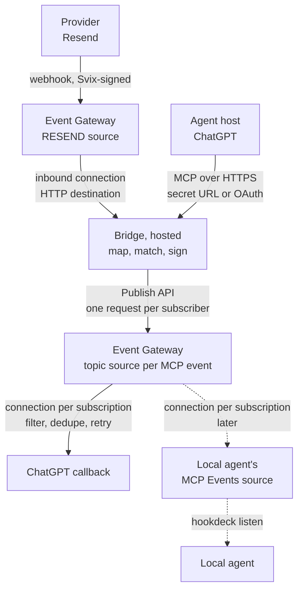

# MCP Events bridge: architecture

Status: draft, revised 5 Oct 2026. Repo `hookdeck/mcp-events-bridge`, npm package `@hookdeck/mcp-events-bridge`.

This is the design. The staged plan and its status are in [`PLAN.md`](PLAN.md), and spike results in [`SPIKES.md`](SPIKES.md). Agents working on the repo should also read `AGENTS.md` at the repo root.

## What it does

The bridge lets an agent subscribe to things that happen in apps whose vendors haven't shipped MCP Events. It turns a provider's ordinary webhooks into MCP Events.

- **Hookdeck Event Gateway** receives and verifies the provider's webhooks, and delivers every MCP Event to every subscriber with retries and a record of each attempt.
- **The bridge** is the MCP side: the event catalog, subscriptions, the challenge, and turning a provider webhook into signed MCP Events.
- **The Hookdeck CLI** is how anything local takes part: a local agent receiving events, or the bridge itself running on a laptop. Both come after the hosted path.

Worked example: Resend inbound email. Someone emails an address on Resend, Resend sends `email.received`, and a ChatGPT dot (or a local agent) subscribed to that event wakes up and acts.

## Goals and non-goals

Goals:

- Events for providers that haven't shipped MCP Events, starting with Resend.
- **Hosted first.** The bridge runs as a service with a public MCP endpoint that ChatGPT connects to directly.
- **Local agents through the Hookdeck CLI.** Events reach a laptop through Event Gateway and `hookdeck listen`, including events that arrive while it's offline.
- **Low friction for self-hosters.** Nothing beyond Hookdeck and the providers themselves is required: no identity provider, no tunnel service.
- **Built on Hookdeck.** Event Gateway and the Hookdeck CLI do the receiving, delivering and local delivery; where they can't yet, the design says what would close the gap (see "Evolution").
- Setup through a typed config file (`bridge.config.ts`) that a coding agent can edit: "add Resend inbound email".
- Event Gateway as the single record of every provider's events, inbound and outbound.
- A path to taking the bridge out of the data path entirely (see "Evolution").

Non-goals for now:

- **Wrapping provider APIs as tools.** Vendors' own MCP servers do that. Resend's already lists and reads inbound emails. The bridge supplies events only.
- **Hosting the bridge for other people.** That's the multi-tenant product and a separate decision.
- **A required identity provider or tunnel service.** Authentication starts with a secret URL; OAuth and tunnels are optional (see "Authentication").

## System overview



The challenge at subscribe time is the one thing the bridge sends straight to a callback, because it needs the echo back synchronously.

## Delivery: the relay

The bridge sits between two Event Gateway sources and holds no event state. Event Gateway is the durable store on both sides.

1. Resend sends `email.received` to the RESEND source. Event Gateway verifies the Svix signature.
2. The inbound connection delivers to the bridge's public inbound route. The bridge verifies the Hookdeck signature.
3. The bridge maps the request with the provider manifest and matches it against live subscriptions.
4. For each match, it builds the MCP Events envelope, signs it with that subscriber's `whsec_` secret, and publishes it to the topic source with `X-MCP-Subscription-Id`.
5. If every publish succeeds, it returns `200`. If anything fails, it returns `5xx` and Event Gateway retries the inbound event.
6. Each subscription's connection passes only its own request and delivers it to the callback, with its own retries.

Rules that make it correct:

- **Partial failure produces duplicates.** If publishing to A succeeds and B fails, the inbound retry publishes to A again. Each subscription connection has a dedupe rule on `headers.webhook-id`, which is the provider's event id and stable across retries. Dedupe is best-effort with a window of at most 1 hour, so subscribers must still dedupe on `webhook-id`.
- **The inbound retry rule finishes inside the dedupe window.** For example, linear retries that end within an hour.
- **Publish to all matches in parallel,** so the inbound response stays well inside the destination timeout.
- **Skip subscriptions created after the event's `occurredAt`,** so an inbound retry doesn't hand a new subscriber an old event.
- **Outbound retries carry the first signature.** Event Gateway passes the published headers through unchanged, so a retry has the original `webhook-timestamp`. The spec says each retry attempt MUST regenerate the timestamp and signature, so this doesn't conform (see "Spec conformance"). Keep each subscription connection's retries inside 5 minutes, the window inside which receivers SHOULD accept a timestamp, until Event Gateway can sign Standard Webhooks itself. Stage 3 confirms the pass-through behavior.
- **The inbound connection also dedupes** on `headers.svix-id`, to drop fast provider retries before they reach the bridge. Best-effort, as above.

Both rules on dedupe come from the same caveat in the Event Gateway docs: "Deduplication is a best-effort feature and is not guaranteed."

## Event Gateway topology

Per provider instance (see "Configuration file"):

```text
source:      bridge-<instance id>                 (RESEND)
connection:  bridge-<instance id>-<deployment>
  dedupe:    include_fields [headers.svix-id], window <= 1h
  retry:     linear, finishing within the dedupe window
destination: bridge-<deployment>-inbound -> https://<bridge>/inbound/<instance id>
             (auth: Hookdeck Signature, verified by the bridge)
```

Per MCP event name (a topic), created on first subscribe:

```text
source:      bridge-out-<event name, slugged>     (PUBLISH_API: only Publish API requests accepted)
             e.g. bridge-out-email_received: resource names allow only letters, digits, - and _
```

Per subscription:

```text
connection:  mcp-sub-<id>, from the topic source; description = readable metadata
  filter:    headers X-MCP-Subscription-Id = <id>
  dedupe:    include_fields [headers.webhook-id], window <= 1h
  retry:     exponential, bounded under 5 min, response_status_codes [">=300", "!410", "!413"]
destination: mcp-sub-<id> -> callback URL; auth = the signing secret (CUSTOM_SIGNATURE); the bridge signs
```

Why this shape:

- **One topic source per MCP event name,** not one shared source and not one source per subscription. A shared source records a `FILTERED` ignored event for every other subscription on every publish. A source per subscription has no filter noise but can't move to publish-once later. The topic source keeps the noise to that topic's subscribers and changes in place when Event Gateway can sign (below).
- **One destination per subscription,** even when two subscriptions share a callback URL. Today a destination has no auth, so sharing would work. Once Event Gateway signs, the subscriber's secret lives on the destination, and secrets are per subscription.

## Evolution

### When Event Gateway signs Standard Webhooks

This needs a Standard Webhooks destination auth type in Event Gateway. Today's destination auth methods are Hookdeck Signature, Custom SHA-256, Basic, API key and Bearer; both signature methods sign the body only.

Status: not available today. The subscription's secret already lives in its destination's auth config, so enabling it would be a switch of `auth_type`. Event Gateway already verifies Standard Webhooks on inbound sources; outbound signing would need the signer itself, per-destination secret rotation, and a choice of where `webhook-id` comes from.

What the feature has to do, for this design:

- sign `webhook-id.webhook-timestamp.body` with a `whsec_` secret held on the destination, producing `webhook-id`, `webhook-timestamp` and `webhook-signature`;
- sign fresh on every attempt, with `webhook-id` stable across attempts;
- take `webhook-id` from the request (a header such as `webhook-id`, or a body field), so it stays the provider's event id; Event Gateway's own event id differs per connection, so it can't be used when one request fans out to several subscribers;
- sign with both the old and new secret for a grace window after rotation (space-separated `v1,` signatures);
- allow a header prefix other than `webhook-`, as Standard Webhooks permits;
- validate the destination address at delivery time and not follow redirects, per the spec's SSRF rules.

Then the topology changes in place:

| | Now | With destination signing |
| --- | --- | --- |
| Publishes per event | One per matching subscriber | One per topic |
| Subscription connection filter | `X-MCP-Subscription-Id` | The subscription's arguments, e.g. `from` |
| Destination auth | None; the bridge signs | Standard Webhooks with the subscriber's secret |
| Partial-failure duplicates | Possible; dedupe absorbs them | Gone: one publish is accepted or not |
| Outbound retry window | Under 5 minutes | Normal; fresh signature per attempt |
| Subscriber secrets live in | The bridge | Event Gateway destinations |
| `FILTERED` records mean | Not this subscription | This subscriber's filter didn't match |

Matching moves into Hookdeck filter syntax, which has no regex and no documented case-insensitive matching. The bridge still builds the envelope, so it adds normalized fields before publishing (for example a lowercased bare `fromAddress` parsed from `Name <addr>`), and connection filters use only `$eq` and `$in`. Each manifest declares how its subscribe arguments map to a filter, and subscribe rejects arguments it can't express.

### Hookdeck capabilities that would simplify the design

| Capability | What it would replace or enable |
| --- | --- |
| Standard Webhooks destination auth in Event Gateway | Spec-conformant re-signing on every retry; publish once per topic (above) |
| An MCP Events source type, answering the challenge at the source | Shipped 6 Oct 2026. Local agents receiving through the Hookdeck CLI, and the e2e test subscribers without a tunnel (see "Local agents and the bridge on a laptop") |
| CLI redelivery of events missed while a session was disconnected | The app-side recovery code ported from the fleet demo |
| A request/response mode for the Hookdeck CLI | The cloudflared tunnel for a local MCP endpoint, which needs synchronous responses |

### Outpost for delivery (future option)

Hookdeck Outpost already delivers Standard Webhooks with a fresh signature on every attempt, one destination per subscription, and retries; the Outpost demo passed OpenAI's MCP Events checklist that way on 1 Oct. Using it for the bridge's outbound side would close the re-signing gap today. It's a future option rather than the default because it adds a second service to run or sign up for, and the design keeps Event Gateway as the single product and the single record.

### Research: deliver straight from the provider source

The further step: attach each subscription's connection to the RESEND source itself, with a transformation that builds the envelope. Resend then reaches the agent through Event Gateway alone, and the bridge is control plane only (catalog, subscribe, challenge, connection lifecycle).

Nothing in MCP Events requires the MCP server to be the sender. A delivery is a webhook signed with the subscriber's secret; the signature is what the subscriber checks. The problems are practical:

- **Signing.** Blocked until Standard Webhooks destination auth exists. The interim workaround, signing inside a transformation, is poor: the runtime has no crypto (a pure-JS HMAC would have to be bundled), is synchronous with a 1-second limit, keeps the secret in transformation environment variables, and runs once per event so retries reuse the first timestamp.
- **Per-subscription values.** `X-MCP-Subscription-Id` differs per subscription, so each connection needs its own transformation (or some per-destination header). That's one transformation per subscription to create, update and delete.
- **Mapping runs in the transformation sandbox.** The manifest's `summarize` has to exist as transformation code: no IO, no async, 1 second. Providers whose webhook is too thin and needs an API call to build the event can't use this path; they keep the relay. Resend's `email.received` is metadata-only and would fit.
- **Two copies of the mapping.** The TypeScript manifest (catalog, schemas, tests) and the transformation code must agree. Lean: generate the transformation from the manifest and run the same code under vitest.
- **Failures happen outside the bridge.** A transformation error becomes a `TRANSFORMATION_FAILED` ignored event; nothing tells the subscriber. The bridge learns of it through Event Gateway issue notifications (see "Problem feedback from Event Gateway").
- **Filter expressiveness.** As above: arguments must map to Hookdeck filters, with normalization done in the transformation (rule order: transformation, filter, dedupe, retry).
- **Size.** The 256 KiB payload limit has to be enforced in the transformation.
- **What stays the same:** `get_event` and `list_recent_events` already read from Event Gateway; the challenge is already sent by the bridge; expiry and unsubscribe already delete connections.

To answer before committing to it: whether a destination can carry a per-subscription static header, whether a transformation can be shared across connections with per-connection values, and how transformation failures are surfaced through the API. (Event Gateway documents no limits on the number of connections.)

## Problem feedback from Event Gateway

Event Gateway does most of the delivering, so the bridge needs to hear about problems it no longer sees directly. It uses Event Gateway's own issues and webhook notifications, delivered through Event Gateway like any other event:

```text
issue triggers ──> issue.opened / issue.updated ──> source bridge-hookdeck-notifications
  ──> connection bridge-notifications-<deployment> ──> https://<bridge>/inbound/hookdeck
```

Issue triggers, scoped by name pattern:

| Issue type | Scope | What it tells the bridge | Bridge action |
| --- | --- | --- | --- |
| Delivery, `final_attempt` | connections `mcp-sub-*` | A subscriber's callback is failing, with the response status (in practice from the project's default `first_attempt` trigger; see "Verified facts") | `410`: delete the subscription. Otherwise record it on the subscription, surface it in `list_providers` and `bridge doctor`, and return it in `deliveryStatus`. Then resolve the issue so the next failure notifies again |
| Request, rejection causes | sources `bridge-*` | The provider's requests fail verification, e.g. a rotated Resend secret | Mark the provider unhealthy; `bridge doctor` suggests re-running `bridge setup` |
| Backpressure | destinations `bridge-*-inbound` | The bridge is slow or down | Operator alert only |
| Transformation, `log_level` `fatal` | transformations `mcp-sub-*` (direct path, later) | Mapping is broken for a subscription | Mark the subscription unhealthy |

Notes:

- Webhook notifications are set per project (`PUT /notifications/webhooks` with `topics` and `source_id`). This project is dedicated to the bridge, so that's fine; in a shared project it would need agreeing.
- A delivery issue is aggregated per connection and response status (`aggregation_keys`: `webhook_id`, `response_status`, `error_code`). While it's open, further failures with the same key don't notify again, so the bridge resolves the issue (`PUT /issues/{id}` with `RESOLVED`) after acting on it.
- `issue.opened` carries the connection (`trigger_webhook`, including its `name`, which identifies the subscription), the failing attempt with its `response_status`, and the event (stage 4, `test/fixtures/hookdeck/issue-opened-delivery.json`). Resolving an issue sends `issue.updated`.
- Notifications are Hookdeck-signed deliveries like any other, so the inbound route verifies them the same way.
- New projects come with default issue triggers. `bridge setup` adds its own, scoped by name pattern; the most specific trigger wins.
- To check: whether every `TRANSFORMATION_FAILED` ignored event opens a transformation issue (direct path only).

Nothing goes back to the subscriber: if its callback is failing, there's no channel to reach it. Issue notifications are for the bridge and its operator.

## Local agents and the bridge on a laptop

Local delivery goes through Event Gateway and the Hookdeck CLI, so a laptop gets Hookdeck's durability: events are kept while it's offline and delivered when it reconnects.

### A local agent receiving events

A local agent subscribes like any other subscriber, with webhook delivery. Its callback URL is a Hookdeck source in its own Hookdeck project, and `hookdeck listen` delivers to localhost. To the bridge it looks like any other subscriber, so nothing in the bridge assumes a local callback.

The catch is the challenge. Subscribe sends a signed challenge and needs the value echoed back in the same HTTP response. A plain Hookdeck source answers immediately with its own response, so the echo never comes back and subscribe fails with `-32015`. Local agents therefore use Event Gateway's MCP Events source type (`MCP_EVENTS`, shipped 6 Oct 2026), configured with the subscriber's `whsec_` secret as `webhook_secret_key`:

- **The challenge** is answered at Event Gateway's edge: it checks the signature and echoes the challenge, without creating a request. A wrongly signed challenge gets a 4xx, so subscribe fails with `-32015`.
- **Deliveries** are verified with the same secret (Standard Webhooks) and then flow like any request: to a CLI connection and `hookdeck listen`, with Event Gateway's retries and history on the agent's side.
- **Status codes stop at the source.** The source acknowledges each delivery itself, so the agent's own response (a `410` to stop, a `5xx` to retry) never reaches the bridge's delivery. Retries between the source and the agent are the agent-side connection's job.
- **One secret per source**, so a subscriber that rotates its secret on refresh updates the source first.

Agent-side tooling packages this: a `mcp-events-bridge subscriber` command creates the MCP Events source and its CLI connection, supervises `hookdeck listen`, recovers events missed while the laptop was offline, and forwards them to the local agent. The Claude Code channel shim (from `hookdeck/claude-channel-plugin`) builds on it, turning each delivery into a `notifications/claude/channel` notification.

Offline recovery, as in the fleet demo: with a CLI destination and no session connected, a request is kept with an ignored event of cause `CLI_DISCONNECTED`; within roughly 2 minutes of a drop, events are created and then fail. On reconnect ("Connected" on stdout), recovery lists the source's requests since a watermark, retries `FAILED` events, and retries `CLI_DISCONNECTED` requests for this connection (see "Verified facts").

Fallbacks:

- **Poll** (`events/poll`): for agents that can't run the CLI or receive webhooks. Backed by Event Gateway's stored requests, with the cursor as a position in that history, so it also gives catch-up. Hosts without MCP Events support (Codex CLI, Cursor) get the same implementation as tools.
- **Push** (`events/stream`): not planned. It would bypass Event Gateway; build it only if a client needs it.

### Running the bridge itself locally

The same code runs on a laptop if the inbound connection uses a CLI destination instead of the bridge's public URL. Development uses this from stage 5: the config's inbound mode is `cli`, `bridge setup` upserts the inbound connection with a CLI destination at path `/inbound/<instance id>`, and `bridge serve` runs `hookdeck listen` to the bridge's port. Before starting it, `serve` checks that every connection the config implies exists, on the right source, with a CLI destination at the right path, and fails closed otherwise: `listen` would create default `<source>-cli` connections for a source without one. It then runs a single `hookdeck listen <port> <source>,<source>,...` covering every provider source plus the notifications source; given no connection name, `listen` uses each source's existing CLI connection (verified live). Requests forwarded by the CLI carry the same Hookdeck signature as HTTP deliveries (stage 2), so the inbound route doesn't change. No public URL or tunnel is needed for inbound.

Running it unattended on a laptop (stage 6) brings back what the fleet demo solved:

- the bridge upserts its own connection first and fails closed, because `listen` creates a shared `cli-<source>` connection if the named one doesn't exist;
- a supervisor for `hookdeck listen`, with "Connected" on stdout as the recovery trigger;
- missed-event recovery, ported from `recover.ts`.

Local agents on the same machine connect to the bridge's MCP endpoint on `127.0.0.1`. For ChatGPT to reach a local bridge, the MCP endpoint needs a public URL with synchronous responses: `bridge serve --tunnel` starts a cloudflared quick tunnel and prints the ChatGPT URL, with the same secret-URL authentication.

### When a public tunnel is used

Anything local is reached through the Hookdeck CLI by default, and a subscriber's callback through an MCP Events source. A plain public tunnel (cloudflared) is used only when the caller needs the local response synchronously. Today that means the spike receivers and the e2e subscribers that test status codes (`410`, `5xx`), whose responses Event Gateway acts on, and a local bridge's MCP endpoint for ChatGPT.

## Authentication

Single tenant: one deployment, one owner. Tiers, from least friction:

| Tier | How ChatGPT (or any MCP client) connects | Extra service | Stage |
| --- | --- | --- | --- |
| **1. Secret URL** (default) | `https://<bridge>/mcp/<secret>`, with "No Authentication" in ChatGPT | None | 5 |
| **2. Built-in single-user OAuth** | `https://<bridge>/mcp`; the bridge is its own authorization server, and the owner approves once with an admin password | None | 7 |
| **3. Bring your own identity provider** | `https://<bridge>/mcp`; tokens from the provider, verified against its published keys | Yes, optional | 7 |
| Optional: OpenAI Secure MCP Tunnel | For private-network deployments; `tunnel-client` beside the bridge | Yes, optional | 7 |

**Secret URL.** `BRIDGE_MCP_SECRET` holds at least 32 random bytes, base64url. If it's unset, `bridge setup` generates one and says where to set it (for example `fly secrets set`), then prints the full MCP URL to paste into ChatGPT. The URL is a credential: the bridge redacts the secret segment in its own logs, compares it in constant time, and `bridge setup --rotate-mcp-secret` replaces it (ChatGPT then needs the new URL). Every caller with the URL is the deployment's owner, so there is one principal, `owner`.

**Built-in OAuth.** For real tokens without a third party: authorization code with PKCE `S256`, the `resource` parameter copied into the token audience, ChatGPT's redirect URIs allowlisted, and client registration by CIMD (Client ID Metadata Documents) or dynamic registration. Built on a maintained library rather than hand-written; which one supports CIMD and resource indicators is still to check. The token subject becomes the principal.

**Bring your own identity provider.** `auth: { issuer, audience, allowedPrincipals }`: standard discovery and signature checks, so any compliant provider works.

## Process model

One service per deployment:

- **One HTTP listener** (`BRIDGE_PORT`): `POST /inbound/<instance id>` (Hookdeck-signed only; runs the relay; `200` or `5xx`) and the MCP endpoint at `/mcp/<secret>` (or `/mcp` with OAuth): Streamable HTTP, stateless per the 2026-07-28 revision, as in `mcp-events-outpost-demo`. Deployed, it's public; on a laptop it binds to `127.0.0.1`.
- **The subscription index:** in memory, loaded from Event Gateway at startup (see "Data model").
- **The sweeper:** expires subscriptions and deletes their connections and destinations.

Pull-only hosts use poll mode (see "Local agents and the bridge on a laptop").

## Module layout

```text
src/
  core/                 runtime-agnostic: fetch, and no node: imports except node:crypto
    providers/          defineProvider + one file per built-in provider (resend.ts first)
    events.ts           inbound request -> BridgeEvent (via the manifest)
    relay.ts            map, match, sign, publish; throws on any failure
    catalog.ts          events/list from enabled providers
    subscriptions.ts    subscribe, refresh, unsubscribe, sweep; challenge; TTL; per-subscription EG resources
    match.ts            subscribe arguments -> filter
    sign.ts             Standard Webhooks signing
    callback.ts         parse and check callback URLs, build the challenge; CallbackTransport interface
    store.ts            SubscriptionStore interface
    event-gateway-store.ts  subscriptions kept in Event Gateway: metadata in descriptions, secrets in destination auth
    memory-store.ts     for tests
    names.ts            Event Gateway resource names
    hookdeck.ts         Event Gateway API and Publish API client
    mcp.ts              MCP server: tools + hand-registered events/* handlers
    auth.ts             secret-URL check; OAuth token verification later
  host/
    callback-transport.ts  CallbackTransport over node:http(s) with a pinned, public-only DNS lookup
    server.ts           HTTP listener: inbound routes and the MCP endpoint
  config.ts             defineConfig, env(), config loading and validation
  cli.ts                serve | setup [--prune] | doctor
test/
```

Later: `host/cli-supervisor.ts` and `host/recovery.ts` (local bridge and the subscriber command), `core/poll.ts`, `adapters/claude-channel.ts`, and built-in OAuth.

The `core/` boundary keeps a serverless build possible. `node:crypto` is allowed because Workers (with `nodejs_compat`), Deno and Bun support it. Sending to a callback is not: the SSRF guard resolves the host, rejects non-public addresses and pins the connection to the checked IP, which `fetch` can't do. So `core/` calls a `CallbackTransport`, and `host/` implements it with `node:dns` and `node:http(s)`. A serverless host would supply its own. Today only the challenge uses it, since Event Gateway makes the deliveries.

### What to reuse

From `hookdeck/mcp-events-outpost-demo` (passed OpenAI's checklist with ChatGPT on 1 Oct):

| File | Use |
| --- | --- |
| `src/server/callback.ts` | `verifyEndpoint` (the challenge), `parseCallbackUrl`, public-address checks with `allowLocal`. Split on port: pure checks to `core/callback.ts`, `postToCallback` and the pinned lookup to `host/callback-transport.ts` |
| `src/server/identity.ts` | `deriveSubscriptionId` for idempotent subscribe |
| `src/server/errors.ts` | MCP Events error codes, including `-32015` for a failed challenge |
| `src/shared/secret.ts`, `src/shared/standard-webhooks.ts` | `whsec_` checks and signing |
| `src/server/subscriptions.ts` | Subscribe, refresh, unsubscribe and sweep; replace the Outpost calls with Event Gateway connection and destination management |
| `src/server/mcp.ts` | The pattern: the SDK has no MCP Events support, so `events/*` are registered by hand |
| `src/client/subscriber.ts` | The test subscriber |
| `scripts/tunnel.ts` | cloudflared quick tunnel, for a development test subscriber's callback |

From `hookdeck/hookdeck-demos/hookdeck/cli-fleet-fanout`:

| File | Use |
| --- | --- |
| `shared/src/hookdeck.ts` | API client and its documented gotchas |
| `per-machine/src/ensure-connection.ts` | Upsert a connection at boot, fail closed (local bridge, later) |
| `per-machine/src/recover.ts` | Recovery (local bridge, later) |
| `shared/src/machine.ts` | How `listen` is spawned and "Connected" detected (local bridge, later) |

Also: `hookdeck/claude-channel-plugin` for the channel shim, and `hookdeck/webhook-skills` for per-provider event lists and verification details.

## Configuration file

The bridge is a technical product: whoever runs it configures credentials and deploys it. Configuration is a typed file, `bridge.config.ts`, and it's the single source of truth for which providers are set up. Setup "from an agent" means a coding agent editing this file and running `bridge setup`, not MCP tools.

```ts
// bridge.config.ts
import { defineConfig, env } from '@hookdeck/mcp-events-bridge';
import { resend, github } from '@hookdeck/mcp-events-bridge/providers';
import { acmeCrm } from './providers/acme-crm';   // custom, written with defineProvider

export default defineConfig({
  deployment: 'prod',
  providers: [
    resend({ apiKey: env('RESEND_API_KEY'), events: ['email.received'] }),
    github({
      id: 'github-hookdeck',                      // instance id; defaults to the provider type
      token: env('GITHUB_TOKEN'),
      scope: { org: 'hookdeck' },
      events: ['issues.opened', 'pull_request.opened'],
    }),
    acmeCrm({ webhookSecret: env('ACME_WEBHOOK_SECRET'), events: ['contact.created'] }),
  ],
  auth: { mode: 'secret-url' },                    // later: 'builtin-oauth' or { issuer, audience, allowedPrincipals }
  subscriptions: { defaultTtlMs: 30 * 24 * 3600_000 },
});
```

- **Secrets are `env()` references only,** so the file can be committed and reviewed.
- **Each provider entry is an instance** with an `id`, so one deployment can have several of the same provider (two Resend accounts, several GitHub orgs). Event Gateway resources are named after the instance id.
- **Providers are code.** Built-in providers ship with the package; a deployment adds its own with `defineProvider` and redeploys, with no fork and no bridge release.
- **The config is loaded at startup.** A TypeScript config is imported through `tsx`'s API (`tsImport`), so it works from source and from the published package, which ships compiled JavaScript in `dist/`. A serverless build would bundle the config as an ordinary module, so the `core/` boundary is unaffected.

Applying it:

- **`bridge setup`** upserts each instance's source and inbound connection and registers its provider webhook. Idempotent.
- **`bridge serve`** compares the config with the store and Event Gateway at startup and fails closed if a declared instance isn't set up.
- **`bridge doctor`** reports drift and unhealthy instances (see "Problem feedback from Event Gateway").
- **Removing an instance from the file deletes nothing** until `bridge setup --prune`, so a bad deploy can't unregister webhooks by accident.

The bridge ships as the npm package `@hookdeck/mcp-events-bridge` with a CLI binary, `mcp-events-bridge`; the repo `hookdeck/mcp-events-bridge` holds the package and examples.

## Data model

No database. Event Gateway is the store, so the bridge is stateless and needs no volume:

- **Events:** never stored by the bridge; Event Gateway is the record of every event.
- **Subscriptions:** one connection each, `mcp-sub-<id>`, from the topic source to an HTTP destination at the callback URL:
  - **connection description:** readable JSON metadata, so the operator can see it in the dashboard: `{"v":1,"principal":…,"event":…,"arguments":…,"expiresAt":…,"createdAt":…,"updatedAt":…}`, plus `delivery` while it isn't healthy. At most 500 characters; subscribe rejects arguments that don't fit.
  - **destination auth:** the signing secret, as `CUSTOM_SIGNATURE` config. This is Event Gateway's field for credentials: masked in the dashboard and in every listing, returned only by `GET /destinations/{id}?include=config.auth`. It's also where the secret will be used once Event Gateway can sign Standard Webhooks.
- **Topics:** found by name, `bridge-out-<event name, slugged>`.
- **Provider instances:** found by name, `bridge-<instance id>` and `bridge-<instance id>-<deployment>`, with the provider's webhook id in the source description.

At startup the bridge lists `mcp-sub-*` connections, reads each destination's secret, and builds an in-memory index; subscribe, unsubscribe, refresh and issue handling keep it current. That assumes one bridge instance per deployment, which fits single tenancy. A description edited into something unreadable is skipped and reported at startup.

Two consequences of keeping the secret in destination auth:

- **An extra header.** With `CUSTOM_SIGNATURE`, Event Gateway adds an HMAC of the body under `x-mcp-bridge-hmac` to each delivery (verified live). Subscribers ignore it; it reveals nothing about the secret. It goes away when the destination switches to Standard Webhooks auth.
- **The previous secret during a rotation has no slot,** so it's kept in memory for its grace window. A restart inside the window ends dual-signing early (dual-signing is a SHOULD).

The description format is versioned (`{"v":1,…`) so a sealed, encrypted format could be added later, for example for multi-tenant hosting, and told apart when reading.

## Provider manifests

Manifests describe events. They don't wrap provider APIs, apart from registering the webhook at setup. Built-in and custom providers are both written with `defineProvider`, which returns the factory used in the config file.

```ts
const resend = defineProvider({
  type: 'resend',
  displayName: 'Resend',
  sourceType: 'RESEND',                  // Event Gateway source type
  options: z.object({                    // typed config options: credentials and setup arguments
    apiKey: secretRef(),
    events: z.array(z.enum(['email.received'])),
  }),
  events: [/* ProviderEvent */],
  register?(ctx: { sourceUrl: string; providerEvents: string[]; options: ResolvedOptions; fetch: typeof fetch }):
    Promise<{ webhookId: string; signingSecret: string }>;
  unregister?(ctx: { webhookId: string; options: ResolvedOptions; fetch: typeof fetch }): Promise<void>;
  nativeMcpEvents?: { serverUrl: string; events: string[] }; // vendor ships its own
});

interface ProviderEvent<Args, Summary> {
  name: string;                        // MCP event name: "email.received"
  description: string;
  providerEvent: string;               // the provider's event type
  matches(req: InboundRequest): boolean;
  eventId(req: InboundRequest): string;     // stable provider id
  occurredAt(req: InboundRequest): string;  // ISO 8601
  summarize(req: InboundRequest): Summary;  // well under 256 KiB; includes normalized fields
  inputSchema: JsonSchema;             // subscribe arguments
  parseArguments(args: unknown): Args; // validate and normalize (e.g. lower-cased addresses); throws on invalid input
  accepts(args: Args, summary: Summary): boolean;
  toFilter?(args: Args): HookdeckFilter; // for matching in Event Gateway later
  payloadSchema: JsonSchema;
}
```

`register()` matters beyond convenience: the signing secret the provider returns goes straight onto the Event Gateway source and never enters the model's context.

Resend, first manifest (settled in stage 2; see `SPIKES.md` and `test/fixtures/resend/email-received.json`):

- `sourceType`: `RESEND`. Event Gateway verifies Resend's Svix signature.
- `register()`: Resend's create-webhook API with the source URL and `email.received`; it returns `signing_secret`.
- `matches`: `body.type === "email.received"`.
- `eventId`: the `svix-id` header.
- `occurredAt`: `body.data.created_at` (the received email's time, millisecond precision).
- `summarize`: `emailId` (`data.email_id`), `from`, `to`, `cc`, `subject`, `messageId`, `attachmentCount`, plus normalized `fromAddress` and `toAddresses` (bare, lowercased). Resend sent a bare `from` in stage 2, but normalization stays. The webhook carries metadata only; the body comes from Resend's own MCP server.
- `inputSchema`: `from` and `to` filters, matched on the normalized addresses. Recommend `from` in the event description, since it limits who can wake the agent.

## Adding a provider

Only Resend exists so far, so this is untested until the second manifest.

| Step | What it is | Deploy needed? |
| --- | --- | --- |
| 1. A provider definition exists | Built in, or a custom `defineProvider` in the deployment's own code | Built in: no. Custom: part of the deployment |
| 2. Add an instance to `bridge.config.ts` | Options, events, and `env()` references for credentials | Yes: set the secrets and redeploy |
| 3. `bridge setup` | Creates the source and inbound connection, registers the provider webhook | No, a one-off command (or part of the deploy) |
| 4. Subscribe | Agents call `events/subscribe`; ChatGPT needs "Refresh tools" to see new events | No |

Nothing else in the deployment changes per provider. The inbound route is generic (`/inbound/<instance id>`), and topic sources and subscription connections are created on demand.

Gaps, and where the config file leaves them:

1. **No webhook-creation API.** Many providers only set up webhooks in their dashboard. Partly solved: the provider's signing secret comes from an `env()` option, and `bridge setup` sets it on the source and prints the source URL to paste into the provider's dashboard. The manual paste remains.
2. **No Event Gateway source type.** The source would be a generic `WEBHOOK` source with HMAC verification configured. Open: `defineProvider` needs a field for that verification config.
3. **Where the provider key lives.** Solved: in the deployment's env, referenced from the config. `setup` and `--prune` run from the deployment and need it.
4. **Thin webhooks.** Providers that send an id and expect you to fetch the rest put an API call in the relay. It fits the relay (a failure returns `5xx` and retries) but is untested.
5. **More than one instance** of a provider. Solved: instance ids.
6. **Provider-specific setup arguments,** such as which GitHub repository or organization. Solved: typed `options`.
7. **Manifests as code or data.** Solved for now: code, written in the deployment's own config when it isn't built in. A declarative format can still come later if most providers turn out to be header and JSON-path lookups.

### Second provider: GitHub

GitHub has about 70 webhook event types, most with several actions, and payloads of up to hundreds of KB, so it isn't mapped event by event:

- **One MCP event per GitHub event type:** `github.issues`, `github.pull_request`, `github.push`, `github.workflow_run`, and so on (26 types). The action is a subscribe filter, not part of the name.
- **A generic summary for every type,** from the fields all GitHub payloads share: `event`, `action`, `repository` and `sender` (lower-cased), and the main object's `title`, `number` and `url`. The most-used types add a few fields: labels and state for issues, merged and branches for pull requests, ref, commit count and head commit for pushes, conclusion for workflow runs. Text is capped at 500 characters.
- **Arguments on every type:** `repository`, `actions` and `sender`.
- **The config chooses the types:** `github({ events: [...] })`; the default is issues, issue comments, pull requests, reviews, pushes, releases and workflow runs, and `['*']` enables all. The webhook is registered for exactly those types.
- **Scope:** a list of repositories (`{ repos: ['owner/name', ...] }`) or an organization (`{ org: 'name' }`). Personal accounts have no account-wide webhooks, and organization webhooks need an org admin, so the list is the common case. Every repository's webhook points at the same `GITHUB` source with the same secret; the payload names the repository, and subscribers filter on it.
- **Secret:** GitHub lets the caller choose it, so `register()` generates one and sets it on the source, which verifies `X-Hub-Signature-256`.
- **Manual mode:** `github({ webhookSecret })`, with no token or scope. Setup creates the source with that secret and prints the source URL; you add webhooks to any repositories yourself. Only deliveries signed with the secret get past Event Gateway, so "any repository" means any repository you configured. A GitHub App would make this automatic across installations; that's later.
- **No ids stored:** the bridge finds its webhooks by URL (the source URL), so it doesn't keep an id per repository in the 500-character source description. Registering updates a webhook in place if one already delivers to the source, so re-running after a partial failure doesn't duplicate webhooks.
- **Changing the list:** setup keeps a fingerprint of the repositories and the enabled events in the source description. When either changes, it updates the webhooks and reuses the source's secret, so deliveries in flight still verify. Removing a repository from the list leaves its webhook in place; delete it in the repository's settings, or its events keep arriving (subscribers filtering by repository won't see them).
- **Event id:** `X-GitHub-Delivery`, also the inbound dedupe field. **Occurred-at:** the main object's latest timestamp, else the push's head commit, else the time received. The `ping` sent when a webhook is created matches no event and is ignored.

Still open from "Adding a provider": several instances of the same provider share event names, so two GitHub instances in one deployment would clash in the catalog (gap 5). One instance with a repository list or an organization, filtered by `repository`, covers the common case.

## MCP surface

Handlers registered by hand:

- `events/list`: the catalog from configured providers.
- `events/subscribe`: validate, check the callback, send the challenge, create the subscription's Event Gateway resources, store, return `id` and `refreshBefore`.
- `events/unsubscribe`.

Tools, all read-only apart from subscriptions:

- `list_providers()`: configured instances, their events and health.
- `get_event(eventId)` and `list_recent_events(name?, since?, limit?)`, read from Event Gateway. These also work around openai/codex#50714, where dot runs don't receive event data.
- Poll mode: `events/poll` (`name`, `arguments`, `cursor`, `maxAgeMs`, `maxEvents`), read from Event Gateway's stored requests on the provider source; the cursor is a position in that history. Advertise `"poll"` in each event's `delivery` once built. If a host supports neither MCP Events nor `events/poll`, expose the same implementation as `poll_events` and `wait_for_event` tools.

There are no setup tools: providers change through the config file.

## Flows

### Set up a provider instance (`bridge setup`)

1. Upsert the source `bridge-<instance id>` and the inbound connection `bridge-<instance id>-<deployment>` to the bridge's inbound URL, with the dedupe and retry rules above. Fail if it fails.
2. If the provider has `register()`, create the provider webhook at the source URL and set the returned secret on the source. Otherwise set the secret from the instance's options and print the source URL.
3. Record the instance. Its events join the catalog.

`bridge setup` also ensures the deployment-wide pieces: webhook notifications to `bridge-hookdeck-notifications`, its connection to the bridge, and the issue triggers in "Problem feedback from Event Gateway".

`bridge setup --prune` handles instances that are in the store but not in the config: it unregisters the provider webhook, deletes the inbound connection, and deletes the instance's subscriptions and their resources.

### Subscribe

1. Validate the event name, arguments and `whsec_` secret.
2. Check the callback against the allowlist (ChatGPT's receiver host; Hookdeck source URLs for local agents later). No redirects.
3. Send the signed challenge directly and check the echo. On failure return `-32015`.
4. Derive the subscription id. Upsert the topic source if it's the first subscription to this event, then the subscription's destination and connection.
5. Store and return `id` and `refreshBefore`. Use a long default lifetime: ChatGPT sent no `ttlMs` in the 1 Oct test.

### Receive and relay

As in "Delivery: the relay". Envelope: `eventId` is the provider id, `timestamp` is when the event happened, `data` is the summary, plus `X-MCP-Subscription-Id`. Sign fresh for each publish; an inbound retry re-signs.

### Refresh, expiry and unsubscribe

A refresh with the same parameters updates expiry (and the secret, if it changed). The sweeper deletes expired subscriptions with their connections and destinations. Unsubscribe does the same immediately. Delete the topic source when its last subscription goes.

## Environment

Secrets and per-host values, referenced from `bridge.config.ts` with `env()`:

- `HOOKDECK_API_KEY`: a Project API key, for the Event Gateway API and the Publish API.
- `HOOKDECK_SIGNING_SECRET`: to verify Hookdeck signatures on the inbound route.
- `BRIDGE_INBOUND`: `http` (deployed; the default when `FLY_APP_NAME` is set) or `cli` (development; inbound through `hookdeck listen`).
- `BRIDGE_PUBLIC_URL`: for `http` inbound, an optional override for the base URL Event Gateway delivers to. Unset, it comes from `FLY_APP_NAME` (`https://<app>.fly.dev`). `bridge setup` fails if `http` inbound has no `https` URL.
- `BRIDGE_PORT`.
- `BRIDGE_MCP_SECRET`: the secret path segment of the MCP URL (see "Authentication").
- Provider credentials, under whatever names the config references, for example `RESEND_API_KEY`.
- Optional, stage 7: `CONTROL_PLANE_API_KEY` and `OPENAI_TUNNEL_ID`, for `tunnel-client` (Secure MCP Tunnel).
- `.env.example` lists them all.

## Security

- The inbound route accepts only Hookdeck-signed requests.
- The MCP endpoint is protected by the secret URL by default (see "Authentication"). The URL is a credential: it's redacted from the bridge's logs and can be rotated. OAuth tiers give per-request tokens instead. On a laptop the listener binds to `127.0.0.1`.
- Topic sources are `PUBLISH_API`, so only holders of the project API key can publish to them.
- The callback allowlist and no-redirect rule apply at subscribe, since Event Gateway makes the deliveries.
- Provider keys and signing secrets never pass through tool arguments or results.
- Event content is data, never instructions. Subscribe filters such as `from` limit who can trigger an agent.

## Spec conformance

Checked on 5 Oct 2026 against the MCP Events design sketch (`experimental-ext-triggers-events`, webhook delivery) and OpenAI's MCP Events requirements for ChatGPT. Nothing in this repo is built yet, so every "Designed" below means "the design covers it", not "it works". The rows marked "ported" reuse code from `mcp-events-outpost-demo`, which passed OpenAI's checklist with ChatGPT on 1 Oct.

Status: **Designed** (covered by the design), **Gap** (known not to conform), **Unknown** (depends on something not yet checked), **Event Gateway** (the requirement applies to delivery, which Event Gateway performs), **Not planned** (optional, or not used by ChatGPT, and out of scope for now).

### Catalog and discovery

| Requirement | Level | Status | Notes |
| --- | --- | --- | --- |
| `events` capability in `server/discover` | MUST | Designed (ported) | |
| `listChanged` and `notifications/events/list_changed` | MUST if advertised | Designed | Advertise `listChanged: false`: providers change through the config file and a restart, not at runtime |
| `events/list` with `name`, `delivery`, `inputSchema`, `payloadSchema`; `description` | MUST; SHOULD | Designed | From the provider definitions; `delivery: ["webhook"]` |
| `nextCursor` pagination | MAY | Not planned | Catalogs are small |
| Additive schema evolution; new name for incompatible payloads | SHOULD; MUST NOT reuse | Designed | A rule for provider authors; worth stating in the provider guide |

### Subscribe, refresh, unsubscribe

| Requirement | Level | Status | Notes |
| --- | --- | --- | --- |
| Authenticated principal; reject with `-32012` | MUST | **Partial** | Secret URL (default): a request without the secret is rejected, and every caller with it is the one owner principal. Built-in OAuth or an identity provider gives token-based principals (stage 7) |
| Principal authorized for the event and arguments | MUST | **Gap** | Single-tenant: any principal the deployment accepts can subscribe to any configured event. No per-resource access model |
| Re-check access during the subscription; stop on revocation | SHOULD (spec), required by OpenAI | **Gap** | Only "remove the principal's token". No revocation signal from providers |
| `https` callback URLs; reject others with `-32602` | MUST | Designed | ChatGPT callbacks are `https`; local agents use Hookdeck source URLs, which are `https`. The demo's `allowLocal` (`http` on localhost) is dev-only and doesn't conform |
| `whsec_` secret, 24 to 64 bytes | MUST | Designed (ported) | |
| Deterministic id; idempotent upsert on (principal, URL, name, canonical arguments) | MUST | Designed (ported) | |
| `refreshBefore`; no more than `ttlMs`; `null` only if `ttlMs: null` | MUST | Designed (ported) | ChatGPT sent no `ttlMs`, so the server default applies |
| Keep subscriptions for the granted lifetime, across restarts | MUST (for long TTLs) | Designed | Kept in Event Gateway (connection metadata, secrets in destination auth) and reloaded at startup; verified against the live API |
| Replace the secret on refresh; dual-sign during rotation | MUST; SHOULD | Designed (ported) | The new secret replaces the one in destination auth. The relay signs with both for the grace window; the previous secret is kept in memory, so a restart inside the window ends dual-signing early |
| `cursor` in the subscribe response (`null` if no replay) | MUST | Designed | Always `null`: no replay |
| `truncated` | MAY | Designed (ported) | `true` when a client supplies a cursor, since there's no replay |
| `deliveryStatus` | MAY | Designed | From Event Gateway delivery issues on the subscription's connection |
| `-32013` on limits | MUST when limited | Designed (ported) | Event Gateway has no documented limits on the number of sources, connections or destinations, so limits are the bridge's own |
| Unsubscribe by name, arguments and URL; stop delivery immediately | MUST | Designed (ported) | Deletes the connection and destination. In stage 3, deleting a connection cancelled its scheduled retries |

### Endpoint verification and SSRF

| Requirement | Level | Status | Notes |
| --- | --- | --- | --- |
| Verify intent before delivering (challenge, allowlist, out-of-band or well-known) | MUST | Designed (ported) | Signed challenge sent by the bridge; `-32015` with `data.reason` on failure |
| Cache verification per (principal, URL) | MUST | Designed (ported) | |
| Validate callback URLs; reject non-global addresses | MUST; SHOULD | Designed | At subscribe, and for the challenge through `CallbackTransport` |
| Validate at **delivery** time with a pinned IP (DNS rebinding) | MUST | Event Gateway | Deliveries are made by Event Gateway, which is responsible for delivery-time validation. The bridge adds a subscribe-time callback allowlist (ChatGPT's receiver host, Hookdeck source URLs) |
| Don't follow redirects on delivery | MUST | Event Gateway | Redirect handling is performed by Event Gateway, which makes the deliveries |

### Delivery

| Requirement | Level | Status | Notes |
| --- | --- | --- | --- |
| Headers: `webhook-id` = `eventId`, `webhook-timestamp`, `webhook-signature` (`v1,`), `X-MCP-Subscription-Id`, `Content-Type: application/json` | MUST | Designed | Set by the relay; Event Gateway passes them through |
| Envelope: `eventId`, `name`, `timestamp`, `data`, `cursor` | MUST | Designed | `cursor: null` |
| `data` matches `payloadSchema`; minimal triage fields | MUST; SHOULD | Designed | Provider `summarize` |
| Body at most 256 KiB | SHOULD (spec), hard limit for ChatGPT | Designed | The relay checks size before publishing |
| **Each retry regenerates timestamp and signature** | MUST | **Gap** | Event Gateway redelivers the original headers. Mitigation: retries finish inside 5 minutes, the window inside which receivers SHOULD accept a timestamp. Inbound retries do re-sign. Closes with Standard Webhooks destination signing |
| Exponential backoff, bounded attempts | SHOULD | Designed | Event Gateway retry rule, exponential, inside 5 minutes |
| Don't retry `410` or `413` | MUST | Designed | Retry rule `response_status_codes: [">=300", "!410", "!413"]`, verified in stage 3. Negations alone also retry `2xx` |
| Stable `eventId`, duplicates and out-of-order delivery tolerated | MUST | Designed | Provider event id; dedupe is best-effort, receivers dedupe on `webhook-id` |
| Event content treated as untrusted data | MUST | Designed | No instructions in payloads |

### Optional parts of the spec not covered

| Feature | Level | Status | Notes |
| --- | --- | --- | --- |
| `gap` and `terminated` control envelopes | MUST when used; `terminated` SHOULD on revocation or removed events | Not planned | ChatGPT doesn't support them. `bridge setup --prune` should send `terminated` if a client ever does |
| Poll mode (`events/poll`) | Optional mode | Planned (stage 6) | Fallback for agents that can't receive webhooks; backed by Event Gateway's stored requests, so it also gives replay (`cursor`, `maxAgeMs`, `truncated`). Tools wrap it for hosts without MCP Events support |
| Push mode (`events/stream`) | Optional mode | Not planned | Would bypass Event Gateway; only if a client needs it |
| Replay: non-null `cursor`, `maxAgeMs` | MAY | Not planned | Possible later: Event Gateway keeps every inbound request, so a cursor could be a position in that history |
| Asymmetric `v1a,` signatures and JWKS | MAY | Not planned | |

### Summary

- **Known gaps:** re-signing on every retry, per-principal authorization, and access re-checks. The first is a known limit of the relay and closes with Event Gateway destination signing. The other two come from single-tenant hosting and matter more for anything multi-tenant.
- **Delegated to Event Gateway:** the delivery-time SSRF and no-redirect rules apply to whoever makes the deliveries, which is Event Gateway.
- **Partial:** the authenticated principal. The secret URL authenticates one owner; OAuth tiers (stage 7) give token-based principals.
- **Everything ChatGPT tests in its checklist** is designed, mostly ported from the demo that passed it. That's design, not a passing implementation.

## Verified facts

Checked during design on 4 and 5 Oct 2026. If one turns out wrong, fix it here and note it in `SPIKES.md`.

**Event Gateway API** (base `https://api.hookdeck.com/2026-09-01`), as used by the fleet demo:

- `PUT /connections` upserts by name.
- `GET /requests?source_id=…&created_at[gte]=…` lists inbound requests.
- `GET /requests/{id}/events` and `GET /requests/{id}/ignored_events`. Don't use `GET /events?request_id=`: it's accepted and ignored, and returns unrelated events.
- `POST /requests/{id}/retry` with `webhook_ids: [<connection id>]` limits the retry to one connection. The field isn't in the public API reference; it's what `hookdeck gateway request retry --connection-ids` sends.
- `POST /events/{id}/retry` has no status guard, and a scheduled retry stays armed, so only retry events that have settled as `FAILED`.
- A request retry creates new Hookdeck event IDs.

**Publish API** ([docs](https://hookdeck.com/docs/api/publish.md)):

- `POST https://hkdk.events/v1/publish`, authenticated like the REST API (`Authorization: Bearer $HOOKDECK_API_KEY`).
- Pick the source with `X-Hookdeck-Source-Name` or `X-Hookdeck-Source-Id`. Headers, body, path and query pass through as is.
- A `PUBLISH_API` source accepts only Publish API requests. Published requests count as verified. No idempotency key is documented.

**Resource names and descriptions:** connection, source and destination names must match `^[A-Za-z0-9_-]+$` (no dots); descriptions are at most 500 characters. The mock destination type is `MOCK_API`. A connection listing includes each destination's `config.url` and `description`.

**ChatGPT** (stage 5, 6 Oct): with the app created as "No Authentication" and the secret MCP URL, a Work chat request ("I'd like to know about all inbound emails") subscribed to `email.received` with `arguments: {}`, no `ttlMs`, and `cursor: null`. The callback was `https://connectors.api.openai.com/webhook/mcp-events/<id>`, and it answered the challenge. A Resend email was delivered with `200` on the first attempt, and the task showed the sender, recipient and subject.

**MCP Events source type** (6 Oct, probed in production): a `MCP_EVENTS` source takes `config.auth.webhook_secret_key` (a `whsec_` secret). The bridge's challenge, signed with that secret, was answered on the first try straight after the source was created, so no wait for the secret to reach the edge; a challenge signed with another secret got a 4xx and was recorded as `VERIFICATION_FAILED`. A passing challenge creates no request. Deliveries get HTTP 200 whether or not the signature matches; matching ones are `verified: true`, others are rejected as `VERIFICATION_FAILED`.

**Request search** (stage 5, measured live): `GET /requests` filters on request headers (`headers` as a JSON filter) and returns headers and body with `include=data`, so `get_event` finds an event by its provider id. A new request took about 6 seconds to become findable by header.

**Destination paths** (stage 5, found live): Event Gateway joins the destination path with the request's path, so a request to the source root arrives at `/inbound/hookdeck/` (trailing slash) for issue notifications. The bridge accepts both forms.

**Default issue triggers** (stage 5, found live): a project's default delivery trigger (`first_attempt`, all connections) opens the issue on a connection's first failure; since issues are one per connection and status, the bridge's `final_attempt` trigger then has nothing to open. So the bridge hears about a failing callback at its first failure. Acceptable: a refresh resets the recorded state, and a `410` isn't retried anyway.

**Concurrent upserts** (stage 5, found live): four `PUT /connections` at once, each creating the same new inline source, returned one `500 FATAL_ERROR`. The store serializes its writes, and the client retries idempotent calls (`GET`, `PUT`, `DELETE`) on 5xx; publishes aren't retried, since the relay returns 502 to Event Gateway instead.

**Request retry eligibility** (stage 5, found live): `POST /requests/{id}/retry` is refused (`400`) unless the request was rejected or has ignored events. To deliver a processed request again, retry its event (`POST /events/{id}/retry`).

**Connection upsert and existing sources** (stage 5, found live): naming an existing source inline in `PUT /connections` (`source: { name }`) updates it, resetting its type to `WEBHOOK` and replacing its config, which dropped a `RESEND` source's signing secret. Bind an existing source with `source_id` instead. `bridge setup` does, and re-registers the provider webhook if a source has lost its secret.

**Destination auth as credential storage** (stage 5, verified live): a `CUSTOM_SIGNATURE` destination stores `auth.signing_secret`; the value is masked (`auth: {}`) in create, get and list responses, and returned only by `GET /destinations/{id}?include=config.auth` (listings don't return it even with `include`). Event Gateway adds the configured header with an HMAC of the body to each delivery.

**Retry rules** (stage 3, [docs](https://hookdeck.com/docs/retries)): `response_status_codes` takes codes, ranges (`500-599`), comparisons (`>=500`) and negations (`!410`), evaluated last match wins. A list of negations alone (`["!410", "!413"]`) matches every other status, `2xx` included, so a successful attempt is retried again until the count runs out; use `[">=300", "!410", "!413"]`. Unset, any non-`2xx` is retried. The CLI's `--rule-retry-response-status-codes` accepts integers only.

**Publish API pass-through** (stage 3): published headers and body reach the destination unchanged on every attempt, including `webhook-id`, `webhook-timestamp` and `webhook-signature`. Between attempts only `x-hookdeck-attempt-count` and `x-hookdeck-attempt-trigger` change. Event Gateway adds `idempotency-key`, the `x-hookdeck-*` headers, and `sentry-trace` and `baggage` tracing headers.

**Connection deletion** (stage 3): deleting a connection after a failed attempt cancelled its scheduled retries.

**Resource limits:** the [limits page](https://hookdeck.com/docs/limits) covers payload size, delivery timeout, retry attempts and throughput, with no limit on the number of sources, connections or destinations; "Each source supports an unlimited number of unique connections."

**Rules and ignored events:**

- Filters ([docs](https://hookdeck.com/docs/filters)) apply to body, headers, query and path. Operators: `$eq`, `$neq`, `$in`, `$nin`, `$startsWith`, `$endsWith`, `$gt`, `$gte`, `$lt`, `$lte`, `$exist`, `$and`, `$or`, `$not`, `$ref`. No regex. Verified in stage 4: `$in` on a string is a substring match; an array in a filter matches when the array contains all the values; string matching is case-sensitive.
- Dedupe ([docs](https://hookdeck.com/docs/deduplication)) is a connection rule with `include_fields` or `exclude_fields` (paths start with `headers`, `body`, `query` or `path`) and a window of 1 minute to 1 hour. Duplicates become ignored events. Best-effort. Rule order is configurable.
- Ignored event causes ([docs](https://hookdeck.com/docs/requests)): `DISABLED`, `FILTERED`, `TRANSFORMATION_FAILED`, `CLI_DISCONNECTED`, and `DUPLICATE` for a dedupe hit (stage 4; not in the docs' list). A non-matching filter records one per connection per request.
- Destination auth ([docs](https://hookdeck.com/docs/authentication)): Hookdeck Signature, Custom SHA-256, Basic, API key, Bearer. No Standard Webhooks.
- Transformations ([docs](https://hookdeck.com/docs/transformations)): no IO, no async, 1-second limit, 5 MB code, environment variables for secrets, can set headers, no built-in crypto.

**Issues and notifications** ([issue triggers](https://hookdeck.com/docs/issue-triggers), [issues](https://hookdeck.com/docs/issues)):

- Issue types: delivery (`strategy`: `first_attempt` or `final_attempt` in the API, scoped by `connections`), transformation (`log_level`: `warn`, `error`, `fatal`, scoped by `transformations`), backpressure (`delay`, default 600000 ms, scoped by `destinations`), request (`rejection_causes`, scoped by `sources`).
- Scope is `*`, ids, or name patterns with wildcards and exclusions (`prod-*`, `!staging-*`). The most specific matching trigger runs.
- Webhook notifications: topics `issue.opened`, `issue.updated`, `event.successful`, `deprecated.attempt-failed`, sent to a source in the project.

**Hookdeck CLI** (3.1.0 installed):

- Non-interactive login into a private config: `hookdeck ci --api-key $HOOKDECK_API_KEY --hookdeck-config <path>`.
- `hookdeck listen <port> <source> <connection> --output compact --device-name <name> --hookdeck-config <path>`, with the exact connection name. If that connection doesn't exist, `listen` creates a shared `cli-<source>` connection.
- "Connected" on stdout means the session is up; that's the recovery trigger.
- Relevant `gateway connection upsert` flags: `--source-type`, `--source-webhook-secret`, `--destination-type`, `--destination-cli-path`, `--destination-url`, `--rule-filter-headers`, `--rule-retry-strategy`, `--rule-retry-count`, `--rule-retry-interval`, `--rule-retry-response-status-codes`. The last accepts integers only, so negated codes have to be set through the API (stage 3).

**CLI destination behavior:**

- When no session is connected, the request is kept with an ignored event of cause `CLI_DISCONNECTED`, and no event is created.
- Within roughly 2 minutes of a session dropping, events are created and then fail (`CLI_UNAVAILABLE`).
- Every connected session on a destination gets a copy.

**MCP Events,** from the demo and OpenAI's plugin docs:

- The MCP TypeScript SDK has no MCP Events support. Register `events/list`, `events/subscribe` and `events/unsubscribe` by hand, and cast the `events` capability, as `src/server/mcp.ts` in the demo does.
- Subscribe sends a signed challenge to the callback and must check the echo; a failure returns `-32015`.
- Deliveries are Standard Webhooks with the subscriber's `whsec_` secret. The envelope's `eventId` stays the same across retries.
- Don't retry `410` or `413`. Keep payloads under 256 KiB.
- ChatGPT sent no `ttlMs` in the 1 Oct test.

**Resend:**

- Webhooks are Svix-signed, with `svix-id`, `svix-timestamp` and `svix-signature` headers.
- The create-webhook API returns a `signing_secret`.
- `email.received` carries metadata only: `type`, `created_at`, and `data` with `email_id`, `from`, `to`, `received_for`, `cc`, `bcc`, `subject`, `message_id`, `attachments`, `created_at` (stage 2).
- Every account gets a receiving domain, `<id>.resend.app`; mail to any address on it is received. No custom domain needed.
- Event Gateway passes `svix-*` headers through and rejects unsigned requests to a `RESEND` source as `VERIFICATION_FAILED` without forwarding them; the sender still gets `200` (stage 2).
- Event Gateway has a `RESEND` source type.
- Test emails are sent through Resend's API from a verified sending domain in the dedicated account.

## Plan

The staged build plan and its status are in [`PLAN.md`](PLAN.md); spike results are in [`SPIKES.md`](SPIKES.md).

## Decisions

- **5 Oct, hosted first.** Local agents and a local bridge come after, through the CLI.
- **5 Oct, the relay.** The bridge returns `2xx` only after every publish succeeds, so Event Gateway is the durable store on both sides; no outbox or event table.
- **5 Oct, topology.** One `PUBLISH_API` topic source per MCP event name; one connection and one destination per subscription.
- **5 Oct, configuration file.** `bridge.config.ts` with `defineConfig` is the source of truth for providers; no setup tools in the MCP server. Setup is done by whoever runs the bridge, or a coding agent, through the file and `bridge setup`.
- **5 Oct, poll mode.** The spec's `events/poll` replaces the custom pull tools as the pull interface; tools wrap it only for hosts without MCP Events support.
- **5 Oct, Smithery.** List the bridge on Smithery as an ordinary MCP server first; triggers support only if there's interest.
- **5 Oct, test email.** A verified sending domain in the dedicated Resend account; agents send test emails through Resend's API, so the end-to-end script runs unattended.
- **5 Oct, hosting.** The deliverable is a Docker image of the bridge. Fly.io is the reference host for stage 5 (a Machine; no volume, since Event Gateway is the store). The demo deployment, `mcp-events-bridge-dev` in `ams`, stays in Hookdeck's Fly organization. Deploy docs and automation for Railway and Render follow.
- **5 Oct, name.** GitHub `hookdeck/mcp-events-bridge`, npm `@hookdeck/mcp-events-bridge`, CLI `mcp-events-bridge`.
- **5 Oct, issue feedback.** Delivery, request and backpressure issue triggers are in stage 5; transformation issues come with the direct path.
- **5 Oct, secrets at rest.** Subscription secrets live in Event Gateway destination auth (masked credential storage); no bridge encryption key. Metadata is readable in connection descriptions, since the operator owns it.
- **5 Oct, ChatGPT plan.** Stage 5 is proven with ChatGPT Plus in Developer mode from a Work chat, as the Outpost demo was on 1 Oct. Dot testing waits for an upgraded plan.
- **5 Oct, development inbound.** The Hookdeck CLI (CLI destination plus `hookdeck listen`), not a public tunnel. cloudflared only when a synchronous response is needed (on 6 Oct, the MCP Events source type replaced it for the challenge).
- **5 Oct, authentication.** Tiers by friction: a secret URL by default, then built-in single-user OAuth, then bring-your-own identity provider. The OpenAI Secure MCP Tunnel is optional, for private networks. No extra service is required.
- **5 Oct, local delivery.** Local agents receive webhooks through Event Gateway's MCP Events source and the Hookdeck CLI, with recovery of events missed while offline. Poll from Event Gateway's history is the fallback; push is not planned.
- **5 Oct, Outpost.** A future option for spec-conformant delivery, not the default: it adds a second service.
- **5 Oct, store.** Event Gateway is the store: subscriptions are connections with readable metadata in their descriptions and secrets in destination auth, indexed in memory at startup. No database, volume or encryption key (replaces an earlier SQLite store, then a sealed-description version).
- **5 Oct, `core/` boundary.** `node:crypto` allowed; callback sending behind `CallbackTransport` in `host/`.

## Open questions

- [ ] Standard Webhooks destination auth in Event Gateway: not planned yet. Decides when the re-sign gap closes and publish-once can happen. Needs per-destination secret rotation as well as signing.
- [ ] Delivering straight from the provider source: the research questions in "Evolution".
- [ ] Adding a provider: gaps 2 and 4 in "Adding a provider", and the manual paste in gap 1. Pick a third provider that tests them.
- [ ] Deployments sharing a Hookdeck project: `dev` and `fly` share the provider source (each gets its own inbound connection, so each email goes to both) and the subscription connections, which every running bridge loads. Fine while only one bridge runs; lean: one Hookdeck project per deployment, documented in the README.
- [ ] Multi-tenant hosting: encrypt connection descriptions? The format is versioned so a sealed variant can be added; bigger questions (a Hookdeck project per tenant, quotas, per-user OAuth) come first.
- [ ] Built-in OAuth: which maintained library supports CIMD and resource indicators (for example `oidc-provider`)?
- [ ] Smithery triggers (`ai.smithery/events/*`): an experiment after the listing, if there's interest.
- [x] Delivery issue notifications carry the failing response status, so the bridge deletes a subscription on `410` (stage 4).
- [x] Stage 3: bodies are byte-identical across attempts and match the publisher's, and the signature headers don't change between attempts (see `SPIKES.md`).
- [ ] What ChatGPT does when a refresh fails while the bridge is offline. Lean: long default lifetime until tested.
- [ ] Testing with a dot (needs a ChatGPT plan above Plus). Not needed for stage 5.
- [x] One `listen` for all sources: a comma-separated source list attaches to each source's existing CLI connection (verified live, stage 5). Restart and recovery with several sources come in stage 6.

## Prior art

Searched on 5 Oct 2026. No open-source project turned up that turns third-party webhooks into MCP Events subscriptions, but this was a handful of searches, not a survey.

| Project | What it does | Relation to the bridge |
| --- | --- | --- |
| [Smithery triggers](https://smithery.ai/docs/build/triggers) (preview) | A vendor-prefixed MCP Events profile (`ai.smithery/events/*`). Smithery passes subscribe through to the MCP server, which registers the upstream webhook and delivers signed events straight to the consumer | Closest on protocol. Leaves provider ingestion, signing and retries to each server author, which is what the bridge does. Complementary: the bridge could act as a Smithery trigger server |
| [Composio triggers](https://docs.composio.dev/docs/using-triggers) | Hosted. Provider webhooks (or polling) per connected account, fanned out to trigger instances and delivered to a subscriber URL with a rotatable secret | Closest on function, with its own envelope rather than MCP Events. Its trigger instance per connected account is the bridge's provider instance |
| [Pipedream Connect triggers](https://pipedream.com/docs/connect/components/triggers) | Hosted. Deploy a trigger with a `webhook_url` and get a signing key; or pull recent events from an API | Same shape as subscribe-with-callback plus `list_recent_events`. Not MCP Events |
| Zapier SDK triggers ([docs](https://docs.zapier.com/sdk/index.md)) | Experimental: subscribe to app events in code, with Zapier holding subscription state and webhook reliability | Same idea, closed, not MCP Events |
| [mcp-webhook-events](https://pypi.org/project/mcp-webhook-events/0.2.0/) | Python library for an MCP server to emit MCP Events about its own app | First-party emitting; the bridge is the third-party case |
| [Hook0 MCP](https://www.hook0.com/webhooks-for-ai-agents) | MCP tools to manage the webhooks you send | Outbound management, a different direction |
| Webhook MCP servers ([Svix tutorial](https://www.svix.com/resources/tutorials/webhook-mcp-server/), [stripe-webhook-mcp](https://github.com/3598644/stripe-webhook-mcp)) | Capture webhooks and expose them as pull tools | Like the bridge's pull tools only; no subscriptions |
| MCP gateways ([Microsoft mcp-gateway](https://github.com/microsoft/mcp-gateway), [agentgateway](https://github.com/agentgateway/agentgateway), [rShetty/relay](https://github.com/rShetty/relay)) | Proxies and routing for MCP tool calls | Not events. They make "gateway" and "relay" crowded names |

What the hosted trigger platforms have that the bridge doesn't: years of per-provider trigger catalogs, polling for providers without webhooks (a possible answer to gap 1 in "Adding a provider"), and per-user connected accounts through OAuth.

Naming: the product is a bridge (two protocols, plus the control plane); the relay is one component of it, and a transitional one. "Triggers" is the market's word for an agent subscribing to app events and suits user-facing copy.

## References

- MCP Events design sketch: https://github.com/modelcontextprotocol/experimental-ext-triggers-events/blob/main/docs/design-sketch-proposal.md
- OpenAI, MCP Events for plugins: https://developers.openai.com/plugins/build/mcp-events
- OpenAI, Secure MCP Tunnel: https://developers.openai.com/api/docs/guides/secure-mcp-tunnels
- https://github.com/hookdeck/mcp-events-outpost-demo
- https://github.com/hookdeck/hookdeck-demos/tree/main/hookdeck/cli-fleet-fanout
- https://github.com/hookdeck/claude-channel-plugin
- https://github.com/hookdeck/webhook-skills
- openai/codex#50714: dot runs don't receive MCP event data

Drafted with Claude on 4 and 5 Oct 2026.
